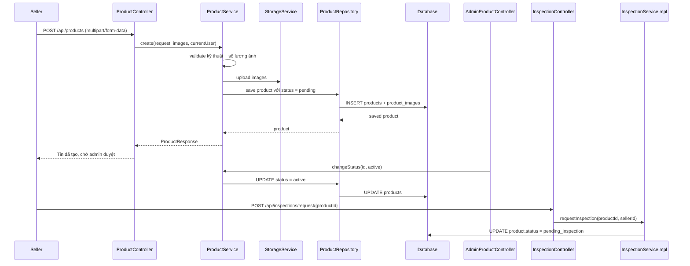

# Seller Listing, Notification, Review, Groupset Và Size Chart: giải thích cho người mới học

## 1. Luồng seller đăng tin bán xe đi như thế nào?

### Bối cảnh

Trong project này, seller không đăng tin xong là public ngay.

Luồng hiện tại là:

1. seller tạo tin
2. hệ thống lưu tin với trạng thái `pending`
3. admin duyệt
4. sau khi duyệt, tin mới chuyển sang `active`
5. lúc đó buyer mới nhìn thấy trong danh sách xe công khai

### Các file chính

- `src/main/java/com/backend/old_bicycle_project/controller/ProductController.java`
- `src/main/java/com/backend/old_bicycle_project/service/ProductService.java`
- `src/main/java/com/backend/old_bicycle_project/controller/AdminProductController.java`
- `src/main/java/com/backend/old_bicycle_project/controller/InspectionController.java`
- `src/main/java/com/backend/old_bicycle_project/service/impl/InspectionServiceImpl.java`

### Luồng backend

### Giải thích đơn giản

- `POST /api/products` là bước seller đăng tin.
- Backend yêu cầu seller nhập đủ các trường kỹ thuật như:
  - `frameSize`
  - `wheelSize`
- Backend cũng yêu cầu tối thiểu 3 ảnh.
- Sau khi tạo xong, product được gắn:
  - `status = pending`

`Pending` ở đây nghĩa là:

- tin vừa tạo hoặc vừa sửa
- chưa được admin cho xuất hiện công khai

### Những trạng thái quan trọng của tin đăng

- `pending`: chờ admin duyệt
- `active`: đang công khai để buyer xem
- `hidden`: đang bị ẩn
- `pending_inspection`: seller đã gửi yêu cầu kiểm định
- `inspected_passed`: đã kiểm định và đạt
- `inspected_failed`: đã kiểm định nhưng không đạt
- `sold`: đã bán xong

### Một hiểu lầm rất dễ gặp

Nhiều người nghĩ:

- seller sửa tin thì cứ sửa xong là vẫn public tiếp

Nhưng trong project này, khi seller sửa tin bằng:

- `PUT /api/products/{id}`

backend sẽ đưa tin về lại:

- `status = pending`

để admin duyệt lại.

Nghĩa là:

- tạo mới -> pending
- sửa -> cũng pending lại
- hiện lại sau khi hide -> cũng pending lại

## 2. Buyer có thể nhận notification khi seller đồng ý và có QR để chuyển khoản không?

### Câu trả lời ngắn

- **Có thể làm được**
- và **một phần đã có rồi**

### Hiện tại hệ thống đang làm gì?

Khi seller bấm chấp nhận đơn:

- `PATCH /api/orders/{orderId}/accept`

thì backend đã gửi notification cho buyer.

Các file chính:

- `src/main/java/com/backend/old_bicycle_project/service/impl/OrderServiceImpl.java`
- `src/main/java/com/backend/old_bicycle_project/service/impl/NotificationServiceImpl.java`

Trong `acceptOrder(...)`, backend có publish notification kiểu:

- người bán đã chấp nhận đơn
- buyer có thể thanh toán tiền ứng trước

### QR hiện được tạo ở bước nào?

QR **không** được tạo ngay lúc seller accept.

QR hiện chỉ được tạo khi buyer gọi:

- `POST /api/payments/orders/{orderId}/request`

Lúc đó backend mới dựng `PaymentRequestResponseDTO` với:

- `qrCodeUrl`
- `checkoutUrl`
- `transferContent`
- `bankBin`
- `bankAccountNumber`

### Ý nghĩa nghiệp vụ

Hiện tại semantics đúng hơn là:

- seller **đồng ý cho buyer thanh toán**
- chứ seller **không trực tiếp gửi QR**

QR là dữ liệu thanh toán do backend sinh ra ở bước payment request.

### Vậy có nên làm notification cho buyer không?

Có, và có 2 mức:

#### Mức 1: như hiện tại, khá hợp lý

- seller accept
- backend gửi notification: “đơn đã được chấp nhận, bạn có thể vào thanh toán”
- buyer mở trang order
- FE gọi `POST /api/payments/orders/{orderId}/request`
- QR hiện ra

Đây là cách gọn và đúng flow hiện tại.

#### Mức 2: notification giàu hơn

Có thể làm thêm:

- sau khi FE hoặc backend tạo payment request thành công
- backend gửi notification cho buyer kiểu:
  - “QR thanh toán đã sẵn sàng”

Nhưng muốn làm vậy thì phải quyết định:

- QR được tạo tự động lúc seller accept
- hay vẫn tạo khi buyer vào màn order

Nếu vẫn để buyer chủ động gọi payment request, thì notification “QR sẵn sàng” sẽ hơi khó hiểu, vì buyer phải là người mở bước đó trước.

### Kết luận thực dụng

Hợp lý nhất lúc này là:

- giữ seller accept -> buyer nhận notification
- buyer vào order -> FE gọi payment request -> hiện QR

Tức là:

- **notification có thể có**
- nhưng **QR hiện tại không nên coi là seller gửi cho buyer**

## 3. Buyer review và seller reply review có khả thi không nếu xe đã bán rồi không còn hiện ngoài marketplace?

### Buyer review có khả thi không?

**Có, hoàn toàn khả thi.**

Vì review trong project này đang gắn với:

- `order`
- `buyer`
- `seller`

chứ không phụ thuộc chuyện product còn đang public hay không.

Các file chính:

- `src/main/java/com/backend/old_bicycle_project/controller/ReviewController.java`
- `src/main/java/com/backend/old_bicycle_project/service/impl/ReviewServiceImpl.java`

Buyer gửi review bằng:

- `POST /api/reviews/{orderId}`

Điều kiện hiện tại:

- order phải ở `completed`
- reviewer phải đúng là buyer của order đó
- order đó chưa có review trước đó

### Review hiện đang hiển thị ở đâu?

Hiện logic backend đang theo hướng:

- lấy review của seller
- theo `sellerId`

API:

- `GET /api/users/{sellerId}/reviews`

Điều này có nghĩa:

- review đang đóng vai trò là **đánh giá uy tín người bán**
- không phải đánh giá một tin đăng đang còn public hay không

Nói đơn giản:

- xe bán xong có thể biến mất khỏi chỗ bán xe
- nhưng review của seller vẫn còn giá trị
- vì review nói về chất lượng giao dịch với seller đó

### Seller reply review có khả thi không?

**Có, rất khả thi về mặt kỹ thuật.**

Nhưng hiện tại backend **chưa có API đó**.

Hiện code mới chỉ có:

- buyer submit review
- public lấy review của seller

Chưa có:

- `PATCH /api/reviews/{reviewId}/reply`
- hoặc bảng riêng để lưu reply

### Nếu làm seller reply review thì nên thiết kế thế nào?

Có 2 hướng:

#### Hướng 1: thêm reply trực tiếp vào bảng `reviews`

Ví dụ thêm cột:

- `seller_reply`
- `seller_replied_at`

Ưu điểm:

- đơn giản
- đủ dùng cho 1 seller reply / 1 review

#### Hướng 2: tạo entity riêng cho reply

Ví dụ:

- `review_replies`

Ưu điểm:

- linh hoạt hơn
- dễ mở rộng nếu sau này muốn admin cũng trả lời

### Kết luận

- buyer review: **đã khả thi và đã có**
- seller reply review: **khả thi nhưng chưa implement**
- việc product đã `sold` hoặc không còn public **không cản trở** flow review, vì review đang gắn với seller và order, không gắn vào chuyện listing có còn public hay không

## 4. Groupset và Size Chart là gì?

### 4.1 Groupset là gì?

`Groupset` là **bộ truyền động** của xe đạp.

Nó thường gồm các phần như:

- tay đề
- gạt đĩa
- củ đề
- líp
- giò đĩa
- đôi khi tính cả phanh nếu theo bộ đồng bộ của hãng

Ví dụ groupset thường gặp:

- Shimano 105
- Shimano Tiagra
- SRAM Red
- GRX 400

Trong project hiện tại, `groupset` đang được lưu khá đơn giản:

- chỉ là một chuỗi text trong bảng `products`

Nó được dùng để:

- hiển thị thông số xe
- filter tìm kiếm

### 4.2 Size Chart là gì?

`Size chart` là **bảng quy đổi size**.

Ví dụ:

- người cao 1m60 đến 1m70 thì nên đi khung size `S`
- người cao 1m70 đến 1m78 thì nên đi size `M`

Nó giúp buyer biết:

- xe này có hợp vóc dáng của mình không

### 4.3 Trong project hiện tại đang có gì?

Hiện backend đang có các field:

- `frameSize`
- `wheelSize`
- `groupset`

và đã dùng các field này cho filter nâng cao.

Nhưng phần:

- admin quản lý danh mục `groupset`
- admin quản lý `size chart`

theo SRS thì **chưa đầy đủ**.

Tức là hiện tại:

- groupset đang là text tự do
- frame size / wheel size cũng đang là text
- chưa có bảng master-data riêng cho groupset
- chưa có bảng size-chart để gợi ý theo chiều cao người dùng

### Kết luận

- `groupset` = bộ truyền động
- `size chart` = bảng gợi ý size phù hợp
- SRS muốn quản lý chúng như một danh mục kỹ thuật bài bản
- còn backend hiện tại mới chỉ ở mức lưu text và filter/search

## 5. Chốt ngắn

### Về seller đăng tin

Luồng hiện tại là:

- tạo tin -> `pending`
- admin duyệt -> `active`
- seller sửa -> về `pending` lại
- seller có thể request inspection khi tin đủ điều kiện

### Về notification thanh toán

- buyer **đã có thể nhận notification** khi seller accept order
- còn QR hiện tại được sinh ở bước buyer tạo payment request

### Về review

- buyer review seller là hợp lý dù product đã sold
- vì review gắn với seller và order
- seller reply review thì khả thi, nhưng hiện chưa có API

### Về groupset/size chart

- groupset là bộ truyền động
- size chart là bảng gợi ý size
- SRS có yêu cầu quản lý chúng sâu hơn, nhưng project hiện mới làm một phần
