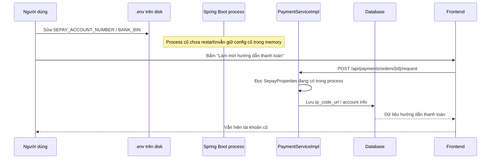

# SePay `.env` Restart Và Hướng Dẫn Thanh Toán Cũ: giải thích cho người mới học

## 1. Hiện tượng

Bạn đã sửa file `.env` để đổi tài khoản nhận tiền từ ngân hàng cũ sang ngân hàng mới, nhưng ở giao diện buyer vẫn hiện:

- số tài khoản cũ
- QR cũ
- tên ngân hàng cũ

## 2. Vì sao chuyện này xảy ra?

Trong project này, cấu hình SePay được bind qua:

- `src/main/resources/application.properties`
- `src/main/java/com/backend/old_bicycle_project/config/SepayProperties.java`

Các giá trị như:

- `SEPAY_BANK_BIN`
- `SEPAY_ACCOUNT_NUMBER`
- `SEPAY_ACCOUNT_NAME`

được Spring Boot đọc khi **app khởi động**.

Điều đó có nghĩa là:

- sửa `.env` trên disk chưa làm app đang chạy tự đổi cấu hình
- process đang chạy vẫn giữ giá trị cũ trong memory

## 3. Dấu hiệu nhận biết

Một cách kiểm tra rất thực tế là:

1. xem `LastWriteTime` của file `.env`
2. xem `CreationDate` của process Java đang chạy backend

Nếu:

- `.env` mới được sửa sau
- nhưng process Java được tạo từ trước đó

thì gần như chắc chắn backend vẫn đang dùng cấu hình cũ.

## 4. Tại sao UI vẫn hiện dữ liệu cũ?

Vì payment request của order được backend provision ra từ cấu hình mà process đang giữ.

Ví dụ:

- process cũ vẫn đang giữ `0363565884`
- khi buyer bấm lấy hoặc làm mới hướng dẫn thanh toán
- backend vẫn tạo `qr_code_url` với số tài khoản đó
- rồi lưu lại vào bảng `payments`

FE chỉ đang hiển thị đúng dữ liệu backend trả về.

Nên đây không phải là lỗi “FE tự nhớ sai”, mà là:

- backend đang provision theo config cũ

## 5. Luồng đi đơn giản

## 6. Cách xử lý đúng

1. sửa `.env`
2. **restart backend**
3. buyer bấm lại:
   - `Làm mới hướng dẫn thanh toán`
   - hoặc tạo payment instruction lại

Sau đó backend mới provision theo tài khoản mới.

## 7. Một hiểu lầm hay gặp

### Hiểu lầm: “Tôi đã đổi `.env`, sao app không tự cập nhật?”

Không đúng với backend đang chạy production-like hoặc dev run bình thường.

`.env` không phải là dữ liệu động được Spring tự reload theo thời gian thực.

Nó chỉ là nguồn cấu hình lúc app khởi động.

## 8. Chốt ngắn

Nếu đổi tài khoản SePay trong `.env` mà UI vẫn hiện tài khoản cũ, lý do thường là:

- backend process chưa restart sau khi sửa `.env`

Và khi buyer bấm làm mới hướng dẫn thanh toán, backend vẫn tạo QR theo config cũ mà process đang giữ trong memory.
