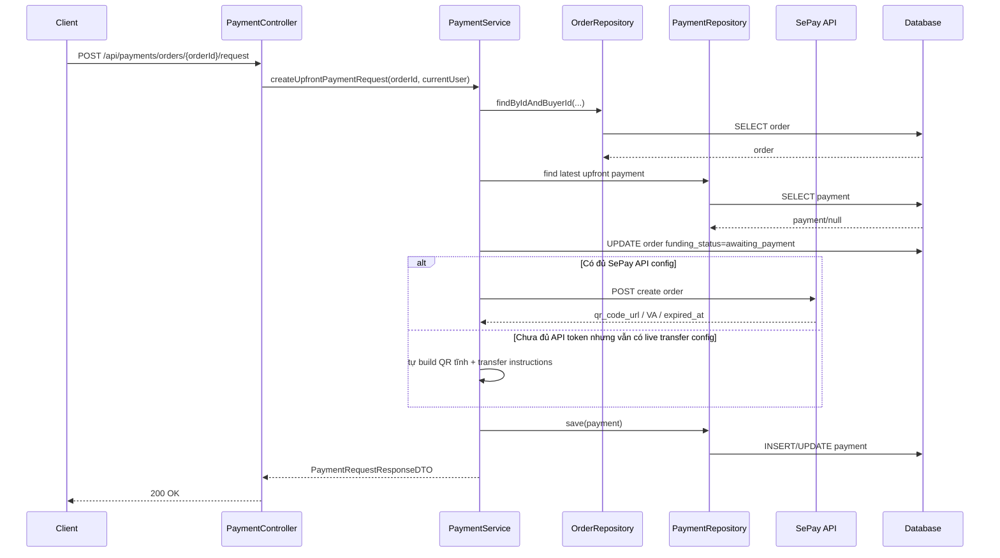
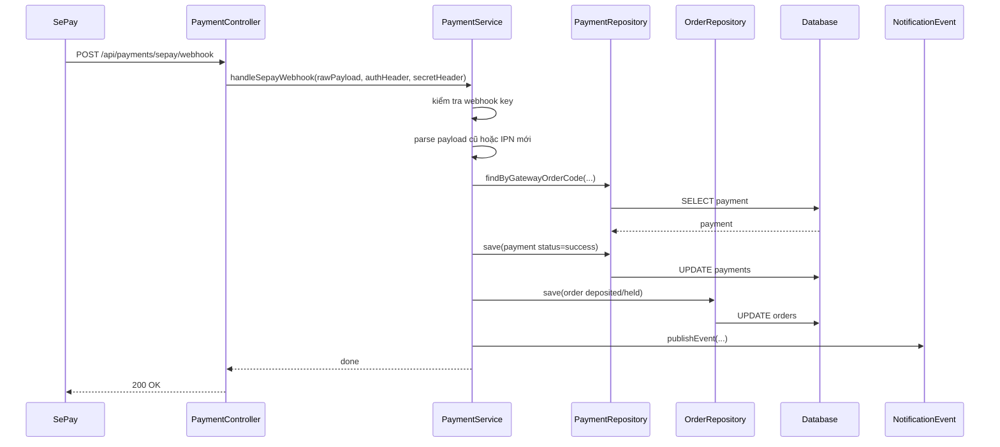
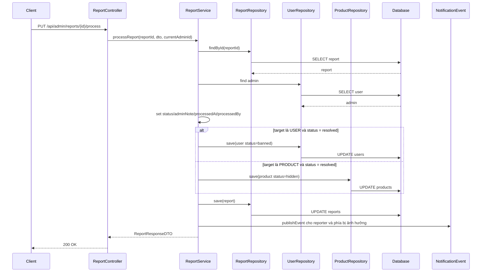

# SePay non-mock và workflow report/admin: giải thích cho người mới học

## 1. Bối cảnh

Ở giai đoạn này, backend đã có:

- order
- payment request
- webhook xác nhận thanh toán
- report user vi phạm / sản phẩm vi phạm

Nhưng vẫn còn 2 câu hỏi lớn:

1. làm sao để payment đi gần production hơn thay vì chỉ mock?
2. khi admin xử lý report thì hệ thống cần lưu lại điều gì để còn truy vết?

Lượt này tập trung trả lời 2 câu hỏi đó.

## 2. Một vài định nghĩa quan trọng

### Mock mode là gì?

`Mock mode` là chế độ giả lập.

Nó có nghĩa là:

- backend giả vờ như đang làm việc với cổng thanh toán
- nhưng thực tế không gọi ra hệ thống thật

Mock mode rất hữu ích khi:

- bạn đang phát triển local
- bạn chưa có tài khoản cổng thanh toán thật
- bạn muốn test logic trước

### Non-mock mode là gì?

`Non-mock mode` là chế độ gần thật hơn.

Nó có nghĩa là:

- backend sẽ cố gọi sang dịch vụ thanh toán thật
- hoặc ít nhất đi theo đường cấu hình production hơn

Trong project này, non-mock mode được hiểu là:

- dùng webhook secret thật
- và nếu có đủ config thì gọi SePay API thật để tạo order

### Webhook là gì?

`Webhook` là một cách để hệ thống A chủ động gọi sang hệ thống B khi có sự kiện.

Ví dụ:

1. người mua chuyển tiền
2. SePay ghi nhận giao dịch
3. SePay gọi về backend của bạn
4. backend đổi trạng thái payment/order

Nói dễ hiểu:

- thay vì backend phải hỏi lại liên tục “đã thanh toán chưa?”
- SePay sẽ chủ động báo “đã thanh toán rồi”

### Audit là gì?

`Audit` là thông tin để truy vết:

- ai làm
- làm lúc nào
- ghi chú gì

Ví dụ trong report workflow:

- admin nào xử lý report
- xử lý lúc mấy giờ
- ghi chú của admin là gì

## 3. Luồng tạo payment request ở non-mock mode

## 4. Giải thích luồng trên bằng ngôn ngữ dễ hiểu

### Bước 1: Client gọi API tạo payment request

Frontend gọi [PaymentController.java](/e:/Old_bicycle_system/BE_old_bicycle_project/old_bicycle_project/src/main/java/com/backend/old_bicycle_project/controller/PaymentController.java).

### Bước 2: Controller chuyển cho service

Controller chỉ nhận request rồi chuyển sang [PaymentServiceImpl.java](/e:/Old_bicycle_system/BE_old_bicycle_project/old_bicycle_project/src/main/java/com/backend/old_bicycle_project/service/impl/PaymentServiceImpl.java).

### Bước 3: Service kiểm tra order

Service xác minh:

- order có thuộc buyer hiện tại không
- order đã được seller accept chưa
- payment deadline còn hạn không
- order có đang ở trạng thái cho phép thanh toán không

Nếu không hợp lệ thì service báo lỗi luôn.

### Bước 4: Service chọn đường đi mock hay non-mock

Đây là phần quan trọng nhất của lượt này.

Service giờ có 2 nhánh:

1. `mock mode`
2. `non-mock mode`

Nếu ở `non-mock` và có đủ `SEPAY_API_TOKEN`, service sẽ gọi SePay API thật để tạo order.

Nếu chưa có token nhưng vẫn có cấu hình nhận chuyển khoản thật, service sẽ đi nhánh fallback:

- build QR tĩnh
- trả hướng dẫn chuyển khoản
- vẫn dùng webhook thật để chốt trạng thái

## 5. Vì sao lại cần cả 2 nhánh trong non-mock?

Vì thực tế dự án thường có nhiều giai đoạn:

- giai đoạn 1: mới có tài khoản ngân hàng + webhook
- giai đoạn 2: đã có API token đầy đủ

Nếu code chỉ chấp nhận “đủ hết hoặc chết”, team sẽ bị kẹt lâu.

Nếu code có fallback hợp lý, bạn vẫn đi tiếp được mà không phải chờ toàn bộ cấu hình production hoàn chỉnh.

## 6. Luồng webhook xác nhận thanh toán

## 7. Vì sao webhook bây giờ nhận cả `X-Secret-Key` và `Authorization`?

Vì trong thực tế có thể có 2 kiểu callback:

- callback mới dùng `X-Secret-Key`
- callback cũ hoặc flow cũ dùng `Authorization: Apikey ...`

Nếu backend chỉ hiểu một kiểu duy nhất, rất dễ fail khi đổi provider mode hoặc đổi document flow.

Cho nên service hiện tại chấp nhận:

- `X-Secret-Key`
- `Authorization`

nhưng vẫn so với cùng một secret đã cấu hình.

## 8. Workflow report/admin mới hoạt động như thế nào?

## 9. Tại sao phải lưu `processed_by`, `processed_at`, `admin_note`?

Vì nếu chỉ lưu mỗi `status`, bạn sẽ không biết:

- ai đã xử lý
- xử lý lúc nào
- xử lý vì lý do gì

Điều đó làm hệ thống rất khó debug và khó giải thích với team.

Ví dụ:

- report A bị resolve
- sản phẩm bị hidden

Nếu không có audit field, sau 1 tuần bạn sẽ khó trả lời:

- admin nào làm việc đó?
- lúc đó họ ghi chú gì?

Nên các field audit rất quan trọng.

## 10. Tại sao phải chặn duplicate open report?

Giả sử cùng một user report cùng một sản phẩm 5 lần liên tiếp khi report đầu tiên còn đang `pending`.

Nếu không chặn:

- admin sẽ thấy nhiều bản ghi trùng nhau
- dashboard bị nhiễu
- thống kê sai

Cho nên service hiện chặn:

- cùng `reporter`
- cùng `target`
- khi report cũ vẫn đang mở (`pending` hoặc `reviewed`)

## 11. Kiến thức rút ra

Khi bạn phát triển backend cho feature “gần production”, hãy luôn tự hỏi:

1. mock path là gì?
2. live path là gì?
3. nếu live path chưa đủ config thì fallback hợp lý là gì?
4. webhook có được xác thực không?
5. khi admin thao tác thì hệ thống có lưu audit không?

Nếu trả lời được 5 câu hỏi này, bạn sẽ tránh được rất nhiều lỗi “chạy được ở local nhưng khó vận hành ngoài thực tế”.
