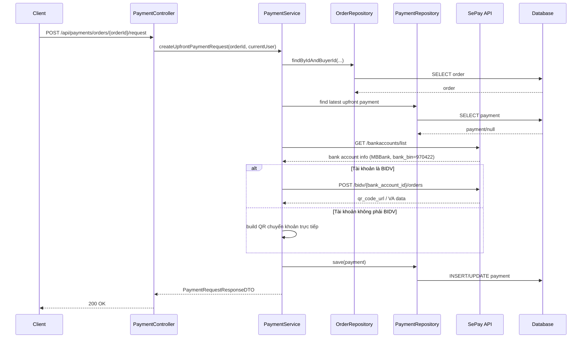
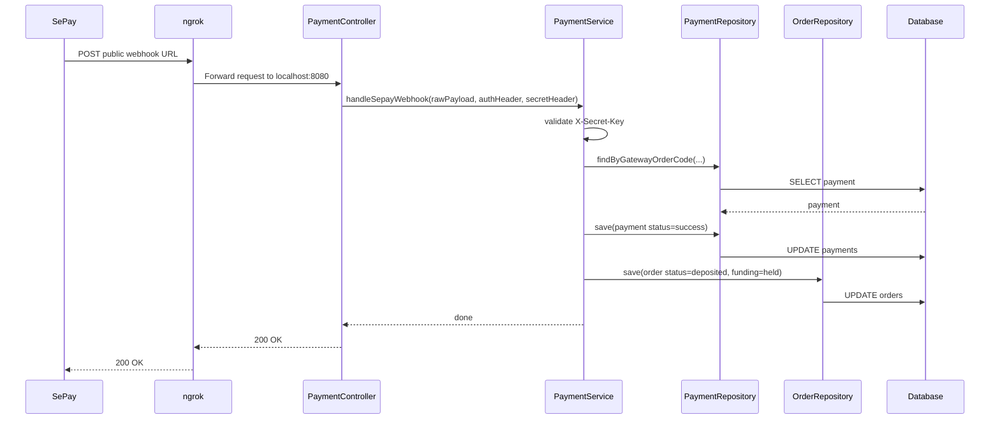

# SePay, MBBank và ngrok IPN: giải thích dễ hiểu cho người mới học

## 1. Bối cảnh

Trong lần làm việc này, mục tiêu là chạy một luồng thanh toán gần giống môi trường thật:

- backend Spring Boot chạy ở máy local
- SePay gọi callback về qua URL public
- tài khoản ngân hàng kết nối với SePay hiện tại là `MBBank`

Ban đầu hệ thống bị lỗi `502 Bad Gateway` khi tạo payment request.

Lý do không nằm ở JWT, controller hay database.
Lý do nằm ở chỗ backend đang gọi nhầm một nhánh API chỉ hợp với `BIDV`.

## 2. Một vài định nghĩa cần hiểu trước

### SePay non-mock là gì?

`Non-mock` nghĩa là backend không còn giả lập toàn bộ payment nữa.

Nó sẽ:

- dùng cấu hình SePay thật
- gọi API thật nếu phù hợp
- nhận webhook/IPN thật để đổi trạng thái payment/order

### VA order API là gì?

`VA` là viết tắt của `Virtual Account`, tức là tài khoản ảo hoặc một mã/tài khoản được tạo ra cho riêng một đơn thanh toán.

Hiểu đơn giản:

- thay vì buyer chuyển khoản vào một tài khoản chung rồi hệ thống phải đoán xem tiền đó thuộc order nào
- hệ thống tạo ra một định danh thanh toán riêng cho order đó

Trong code hiện tại, nhánh này đi qua API kiểu:

```text
/userapi/bidv/{bank_account_id}/orders
```

Ngay tên endpoint đã cho thấy: đây là nhánh gắn với `BIDV`.

### Fallback là gì?

`Fallback` là “đường lui an toàn”.

Khi cách tốt nhất không dùng được, hệ thống không nên chết hẳn nếu vẫn còn một cách khác chấp nhận được.

Trong case này:

- cách ưu tiên: gọi VA order API
- nếu tài khoản hiện tại không phù hợp
- hệ thống fallback sang:
  - tạo QR chuyển khoản trực tiếp
  - dùng `gatewayOrderCode` làm nội dung chuyển khoản
  - vẫn xác nhận thanh toán bằng webhook/IPN

### IPN là gì?

`IPN` là một dạng callback từ cổng thanh toán về backend.

Nó giống như một tin nhắn tự động:

> “Đơn này đã thanh toán rồi, backend hãy cập nhật trạng thái đi.”

## 3. Luồng tạo payment request sau khi đã sửa



## 4. Giải thích từng bước bằng ngôn ngữ dễ hiểu

### Bước 1: frontend gọi API tạo payment request

Frontend gọi endpoint ở [PaymentController.java](/e:/Old_bicycle_system/BE_old_bicycle_project/old_bicycle_project/src/main/java/com/backend/old_bicycle_project/controller/PaymentController.java#L20).

Controller chỉ làm nhiệm vụ nhận request rồi chuyển vào service.

### Bước 2: service kiểm tra order có hợp lệ không

Service ở [PaymentServiceImpl.java](/e:/Old_bicycle_system/BE_old_bicycle_project/old_bicycle_project/src/main/java/com/backend/old_bicycle_project/service/impl/PaymentServiceImpl.java) kiểm tra:

- order có thuộc buyer hiện tại không
- order đã được accept chưa
- deadline thanh toán còn hạn không
- order đã thanh toán rồi hay chưa

Nếu một trong các điều kiện này sai, service dừng luôn.

### Bước 3: service hỏi SePay xem tài khoản đang dùng là tài khoản nào

Đây là phần rất quan trọng của lần sửa này.

Backend gọi `GET /bankaccounts/list` để lấy thông tin tài khoản đang liên kết với SePay.

Kết quả thực tế trả về trong lần test:

- `bank_code = MB`
- `bank_short_name = MBBank`
- `bank_bin = 970422`

Điều này cho backend biết:

- tài khoản hiện tại không phải BIDV

### Bước 4: service quyết định nhánh phù hợp

Trước khi sửa, code cứ thấy có `SEPAY_API_TOKEN` là gọi:

```text
/userapi/bidv/{bank_account_id}/orders
```

Đây là lỗi logic.

Vì tài khoản hiện tại là `MBBank`, gọi endpoint `bidv/...` sẽ không đúng ngữ cảnh và SePay trả `404`.

Sau khi sửa, service làm như sau:

- nếu tài khoản là `BIDV` -> gọi VA order API
- nếu tài khoản không phải `BIDV` -> không cố gọi sai nữa
- thay vào đó build QR chuyển khoản trực tiếp

Đây là một ví dụ rất điển hình của việc:

- **đừng hardcode một giả định kỹ thuật**
- hãy đọc dữ liệu thật từ provider trước rồi mới quyết định

## 5. Luồng IPN qua ngrok



## 6. Vì sao phải có `ngrok`?

SePay là hệ thống bên ngoài.

Nó không thể gọi vào:

- `http://localhost:8080`
- hoặc `http://127.0.0.1:8080`

vì `localhost` chỉ có ý nghĩa trên chính máy đang chạy lệnh đó.

`ngrok` tạo ra một URL public, ví dụ:

```text
https://extrajudicial-fleta-fallalishly.ngrok-free.dev
```

Rồi tự chuyển tiếp request đó về máy local của bạn.

Nhờ vậy:

- SePay gọi vào URL public
- backend local vẫn nhận được callback

## 7. Ứng dụng thực tế vào project này

Trong lần smoke test này:

1. buyer tạo order
2. seller accept order
3. buyer tạo payment request
4. backend gọi SePay thật để lấy thông tin tài khoản
5. backend nhận ra tài khoản là `MBBank`
6. backend fallback sang QR chuyển khoản trực tiếp
7. IPN được gửi về qua URL `ngrok`
8. payment được đánh dấu `success`
9. order được đổi sang `deposited`
10. funding status được đổi sang `held`

Tức là:

- payment path đã đi được gần production hơn
- không còn chỉ là mock nội bộ

## 8. Lỗi hiểu sai rất thường gặp

### Hiểu sai 1: có API token thì lúc nào cũng gọi được VA order API

Sai.

`API token` chỉ chứng minh backend được phép gọi API.
Nó không có nghĩa là mọi endpoint đều hợp với mọi tài khoản ngân hàng.

### Hiểu sai 2: cổng thanh toán trả `404` là chắc do URL backend sai

Sai.

Trong lần này:

- URL backend đúng
- webhook đúng
- auth đúng

Nhưng endpoint SePay bị gọi sai nhánh ngân hàng nên vẫn `404`.

### Hiểu sai 3: fallback là “làm ẩu”

Không đúng.

Fallback tốt là:

- có chủ đích
- có điều kiện rõ ràng
- vẫn giữ được business flow chính

Trong case này fallback vẫn giữ được:

- QR thanh toán
- nội dung chuyển khoản
- webhook xác nhận
- cập nhật payment/order

## 9. Bài học kỹ thuật rút ra

1. Khi tích hợp bên thứ ba, đừng hardcode giả định nếu provider có nhiều biến thể.
2. Hãy đọc dữ liệu thật từ provider trước khi chọn nhánh API.
3. Nếu có thể, hãy thiết kế một fallback path an toàn thay vì để request chết hẳn.
4. Với webhook local, phải có public tunnel như `ngrok`.

## 10. File code nên đọc tiếp

- [PaymentController.java](/e:/Old_bicycle_system/BE_old_bicycle_project/old_bicycle_project/src/main/java/com/backend/old_bicycle_project/controller/PaymentController.java)
- [PaymentServiceImpl.java](/e:/Old_bicycle_system/BE_old_bicycle_project/old_bicycle_project/src/main/java/com/backend/old_bicycle_project/service/impl/PaymentServiceImpl.java)
- [PaymentServiceImplTest.java](/e:/Old_bicycle_system/BE_old_bicycle_project/old_bicycle_project/src/test/java/com/backend/old_bicycle_project/service/impl/PaymentServiceImplTest.java)

## 11. Kết luận ngắn

Lần sửa này không chỉ là “fix một bug 404”.

Nó là bước chuyển từ:

- tư duy “SePay = một API cố định”

sang:

- tư duy “SePay có nhiều kiểu tài khoản/ngân hàng, backend phải chọn nhánh phù hợp”

Đó là một bước rất quan trọng để hệ thống payment ổn định hơn khi đi gần production.
