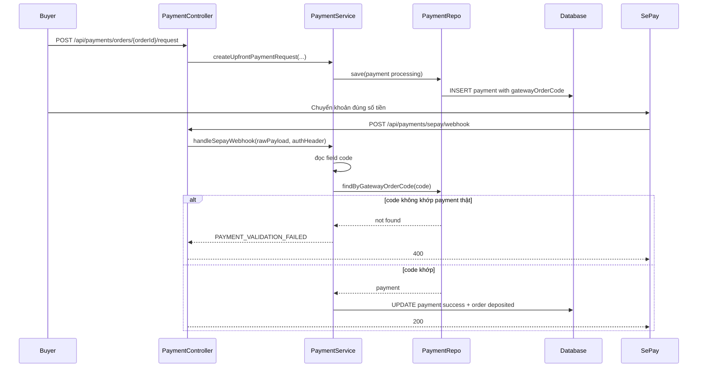
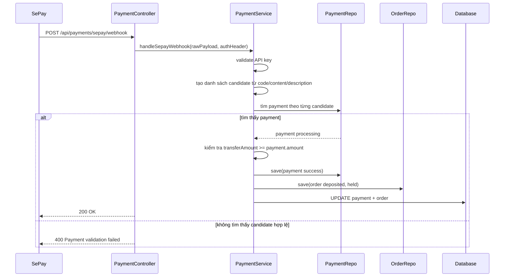

# SePay static QR, Webhook và vì sao `Payment validation failed`

## 1. Bối cảnh

Trong flow thanh toán hiện tại của dự án, có 2 kiểu tích hợp SePay dễ bị nhầm:

- **VA theo đơn hàng**: SePay tạo một mã đơn hàng hoặc tài khoản ảo riêng cho mỗi order
- **Static QR / chuyển khoản thường**: backend chỉ tạo nội dung chuyển khoản và mã QR tĩnh, còn ngân hàng nhận tiền vào tài khoản thật của shop

Bug lần này xảy ra ở kiểu thứ hai.

Case thực tế:

- buyer tạo payment request cho xe `aaaa`
- backend tạo payment đang `processing`
- backend chờ webhook từ SePay
- SePay gọi webhook về
- backend trả `400` với message `Payment validation failed`

## 2. `Webhook validation` là gì?

`Validation` nghĩa là bước kiểm tra xem request webhook có hợp lệ hay không.

Ở bài toán này, backend cần kiểm tra ít nhất 3 thứ:

1. request có đúng API key hay không
2. webhook có chỉ ra đúng payment mà backend đang chờ hay không
3. số tiền gửi vào có đủ hay không

Nếu một trong ba điều này không đúng, backend sẽ không dám cập nhật payment thành công.

## 3. Gốc lỗi cụ thể lần này là gì?

Không phải do số tiền `2000đ` sai.

Khi đối chiếu database, payment của order đó đang chờ đúng:

- `required_upfront_amount = 2000`
- `payment.amount = 2000`

Nghĩa là buyer tạo payment request đúng số tiền.

Gốc lỗi nằm ở **cách backend đọc mã chuyển khoản từ payload webhook**.

Backend cũ giả định rằng webhook luôn có field:

- `code`

và field này chính là `gateway_order_code`.

Nhưng với mode **static QR / chuyển khoản thường**, SePay có thể gửi:

- `content`: nội dung chuyển khoản
- `description`: mô tả giao dịch

trong khi `code` có thể:

- rỗng
- không dùng được
- hoặc không phải mã `gateway_order_code` mà backend đang chờ

Vì vậy backend cũ không tìm thấy payment tương ứng và ném:

- `PAYMENT_VALIDATION_FAILED`

## 4. Luồng lỗi trước khi sửa



## 5. Backend đã sửa như thế nào?

File chính:

- `src/main/java/com/backend/old_bicycle_project/service/impl/PaymentServiceImpl.java`

Ý tưởng sửa:

1. backend không còn chỉ tin vào `code`
2. backend gom nhiều ứng viên có thể là mã thanh toán:
   - `code`
   - mã tách ra từ `content`
   - mã tách ra từ `description`
3. backend thử tìm payment theo từng ứng viên
4. nếu thấy payment thì mới tiếp tục validate amount và cập nhật order

Nói ngắn gọn:

- trước đây: chỉ nhìn `code`
- bây giờ: nhìn `code`, rồi fallback sang `content` và `description`

## 6. Regex là gì và dùng ở đâu?

`Regex` là cách viết mẫu để tìm chuỗi theo quy tắc.

Ở đây backend dùng regex để tách đoạn giống mã thanh toán, ví dụ:

```text
OB-862E6C3FEFB2-183022
```

Tức là nếu `content` dài kiểu:

```text
Noi dung chuyen khoan: OB-862E6C3FEFB2-183022
```

thì backend vẫn tách được phần mã thật bên trong.

## 7. Luồng sau khi sửa



## 8. Test đã thêm gì?

File:

- `src/test/java/com/backend/old_bicycle_project/service/impl/PaymentServiceImplTest.java`

Regression mới gồm:

- webhook không có `code` nhưng có `content` chứa mã thanh toán
- webhook có `code` sai nhưng `content` vẫn chứa đúng mã thanh toán

Điều này quan trọng vì bug vừa rồi không phải case mock đơn giản. Nó là case gần với giao dịch thật hơn.

## 9. Những hiểu lầm dễ gặp

### Hiểu lầm 1: "SePay báo webhook thành công gửi đi là backend chắc chắn sẽ nhận thanh toán"

Không đúng.

SePay chỉ mới gửi request đi thành công. Backend vẫn có thể từ chối nếu validation fail.

### Hiểu lầm 2: "Hễ buyer chuyển đúng số tiền là xong"

Không đủ.

Backend còn phải xác định:

- khoản tiền đó thuộc order nào

Muốn làm được vậy, nó phải đọc đúng `gateway_order_code`.

### Hiểu lầm 3: "Webhook field `code` lúc nào cũng dùng được"

Không đúng.

Điều này phụ thuộc mode tích hợp:

- VA order
- hay static QR / chuyển khoản thường

## 10. Chốt ngắn

Bug `Payment validation failed` lần này xảy ra vì:

- backend cũ quá tin vào field `code`
- nhưng ở flow static QR, mã thanh toán thực tế có thể nằm trong `content` hoặc `description`

Bản sửa mới giúp webhook linh hoạt hơn và đúng với flow đang chạy thật của dự án.

## 11. Vì sao có thể thấy `200 OK` nhưng order vẫn không đổi trạng thái?

Đây là một hiểu lầm rất thường gặp.

`HTTP 200` chỉ có nghĩa là:

- endpoint mà SePay vừa gọi đã trả về thành công ở mức HTTP

Nó **không tự động có nghĩa** là:

- payment trong hệ thống Spring Boot hiện tại đã được xác nhận

Ví dụ có case thực tế:

- SePay log ghi `Status Code = 200`
- response body lại là:

```json
{"error":"No valid order code"}
```

Điều này cho thấy:

- request đã chạm tới một endpoint nào đó
- nhưng endpoint đó không tìm được mã order hợp lệ để xử lý

Nếu endpoint đó không phải backend Spring Boot hiện tại, thì bảng `orders` và `payments` của hệ thống chính vẫn không thay đổi.

### Dấu hiệu nhận biết

Nếu SePay đang gọi vào URL kiểu:

```text
https://<project>.supabase.co/functions/v1/sepay-webhook
```

thì đó là **Supabase Edge Function**.

Trong khi flow backend hiện tại của dự án này lại mong đợi:

```text
https://<ngrok-public-url>/api/payments/sepay/webhook
```

Nghĩa là:

- SePay đang bắn đúng vào một endpoint
- nhưng lại bắn **sai hệ thống**

### Hệ quả

- SePay log vẫn có thể hiện `200`
- nhưng order trong Spring Boot vẫn là:
  - `pending`
  - `awaiting_payment`
- seller và buyer vẫn thấy `Chờ thanh toán`

### Chốt ngắn phần này

Khi debug payment, phải kiểm tra **cả 3 tầng**:

1. SePay gọi URL nào
2. URL đó có đúng backend Spring Boot hiện tại không
3. Response body có phải xác nhận thành công thật hay chỉ là `200` kèm lỗi nghiệp vụ
