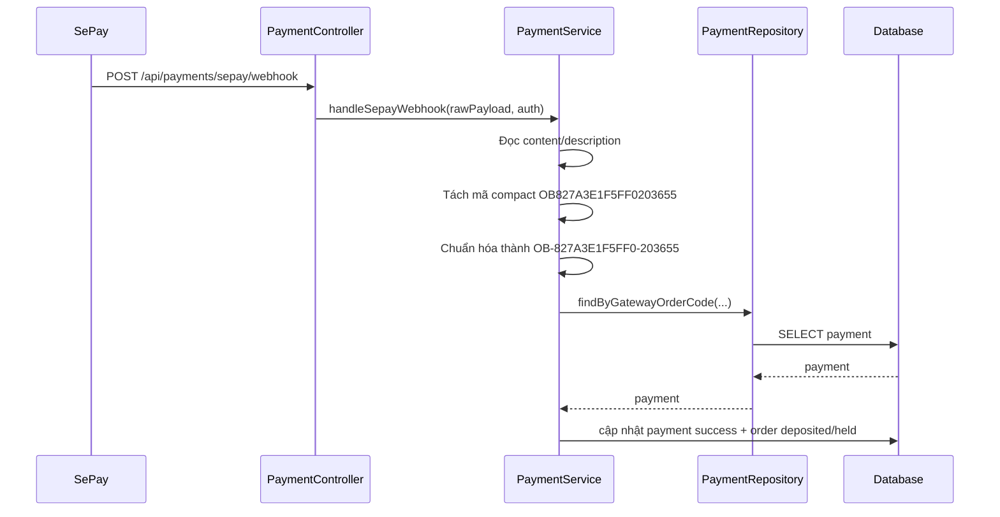

# SePay TPBank Và Mã Order Compact Không Có Dấu `-`: giải thích cho người mới học

## 1. Vấn đề thực tế

Có một case payment rất dễ gây bối rối:

- QR đã sinh đúng
- webhook URL đúng
- API key đúng
- nhưng SePay vẫn trả:

```json
{"code":1015,"message":"Payment validation failed"}
```

Khi mở `Request body log`, ta thấy:

- `code = null`
- mã order không nằm trong field `code`
- mã order lại nằm trong `content` hoặc `description`
- và còn bị đổi từ dạng:

```text
OB-827A3E1F5FF0-203655
```

thành dạng:

```text
OB827A3E1F5FF0203655
```

Tức là mất luôn dấu `-`.

## 2. Vì sao backend cũ fail?

Backend cũ tạo payment với `gatewayOrderCode` dạng:

```text
OB-827A3E1F5FF0-203655
```

Sau đó khi webhook về, backend tìm payment bằng chính mã này.

Nhưng payload thật của TPBank/SePay lại gửi chuỗi liền:

```text
OB827A3E1F5FF0203655
```

Khi đó backend cũ không nhận ra đây là cùng một mã.

Nó hiểu thành:

- không tìm thấy payment hợp lệ

và trả:

- `PAYMENT_VALIDATION_FAILED`

## 3. "Compact code" là gì?

Ở đây, `compact` có thể hiểu đơn giản là:

- dữ liệu bị nén lại
- bỏ bớt ký tự phân cách

Ví dụ:

```text
OB-827A3E1F5FF0-203655
```

biến thành:

```text
OB827A3E1F5FF0203655
```

Nội dung thật không đổi, chỉ là:

- backend lưu mã có dấu `-`
- webhook thật lại gửi mã không có dấu `-`

## 4. Bản sửa làm gì?

File chính:

- `src/main/java/com/backend/old_bicycle_project/service/impl/PaymentServiceImpl.java`

Backend giờ làm thêm 1 bước:

1. tìm mã `OB-...` bình thường trước
2. nếu không có, tìm dạng compact `OB...`
3. nếu thấy dạng compact, backend tự chuẩn hóa lại về dạng:

```text
OB-<12 ký tự>-<6 ký tự>
```

Ví dụ:

```text
OB827A3E1F5FF0203655
```

sẽ được đổi thành:

```text
OB-827A3E1F5FF0-203655
```

Sau đó backend mới dùng mã đã chuẩn hóa đó để tìm payment trong database.

## 5. Luồng đi sau khi sửa



## 6. Giải thích từng bước đơn giản

### Bước 1: SePay gửi webhook

Payload thật không còn `code` rõ ràng.

Nhưng trong `content` vẫn còn dấu vết của order code.

### Bước 2: service cố gắng đọc mã giao dịch

Service không chỉ nhìn `code` nữa.

Nó còn nhìn:

- `content`
- `description`

### Bước 3: service chuẩn hóa mã compact

Nếu chuỗi là:

```text
OB827A3E1F5FF0203655
```

service sẽ biến nó về đúng format mà backend lưu trong DB.

### Bước 4: repository tìm payment

Lúc này repository mới tìm đúng payment cần xác nhận.

### Bước 5: database cập nhật trạng thái

Nếu số tiền hợp lệ:

- payment -> `success`
- order -> `deposited`
- funding -> `held`

## 7. Test nào đã được thêm?

File test:

- `src/test/java/com/backend/old_bicycle_project/service/impl/PaymentServiceImplTest.java`

Đã thêm regression test cho đúng case:

- `code = null`
- `content/description` chứa mã compact không dấu `-`
- `transferAmount = 2000`

Mục tiêu của regression test là:

- nếu sau này ai sửa parser webhook sai
- test sẽ fail ngay

## 8. Hiểu lầm dễ gặp

### Hiểu lầm 1: "Webhook 400 chắc là sai URL"

Không hẳn.

Nếu URL sai, thường bạn sẽ thấy:

- 404
- 401
- hoặc request không vào đúng hệ thống

Ở case này, URL đúng nhưng backend không đọc được mã payment từ payload thật.

### Hiểu lầm 2: "SePay luôn gửi order code trong field `code`"

Không đúng.

Payload thật có thể:

- `code = null`
- nhưng `content` hoặc `description` vẫn chứa mã

### Hiểu lầm 3: "Mã compact là mã khác hẳn"

Không đúng.

Nó chỉ là cùng một mã nhưng bị bỏ dấu phân cách.

## 9. Chốt ngắn

Bug lần này xảy ra vì:

- backend lưu `gatewayOrderCode` dạng có dấu `-`
- nhưng TPBank/SePay webhook thật có thể gửi mã liền nhau, không có dấu `-`

Bản sửa mới giúp backend:

- nhận ra mã compact
- chuẩn hóa lại
- map đúng payment
- xác nhận thanh toán thành công
