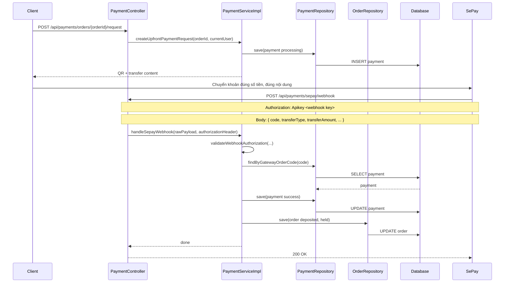
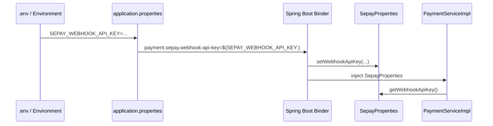

# SePay WebHook-Only, Swagger và ngrok: giải thích rõ cho người mới học

## 1. Bối cảnh

Ở giai đoạn hiện tại, backend của dự án chọn hướng:

- người mua tạo yêu cầu thanh toán
- hệ thống trả về QR/chuyển khoản
- SePay gửi `WebHook` khi có giao dịch tiền vào
- backend xác nhận thanh toán và cập nhật order

Điểm quan trọng là:

- dự án **không lấy IPN làm callback chính nữa**
- dự án chọn **WebHook** vì thực dụng hơn với luồng chuyển khoản trực tiếp hiện tại

## 2. Một vài định nghĩa trước khi đi tiếp

### WebHook là gì?

`WebHook` là một request HTTP mà hệ thống bên ngoài tự động gửi về backend của bạn khi có sự kiện xảy ra.

Trong case này:

- sự kiện là: có giao dịch tiền vào tài khoản SePay/ngân hàng
- SePay sẽ gọi tới backend của bạn

### Swagger là gì?

`Swagger UI` là một trang web tự sinh ra từ backend để:

- xem danh sách API
- đọc request/response mẫu
- bấm nút gửi request để test API

Trong dự án này, Swagger đến từ `springdoc-openapi`.

### ngrok là gì?

`ngrok` là công cụ tạo một URL public trỏ vào backend local.

Ví dụ:

- backend local chạy ở `http://localhost:8080`
- `ngrok` tạo ra URL public như:
  - `https://abc123.ngrok-free.app`

Khi ai đó truy cập URL public này:

- request sẽ được chuyển tiếp về backend local của bạn

## 3. Luồng WebHook hiện tại của dự án



## 4. Giải thích luồng trên bằng ngôn ngữ dễ hiểu

### Bước 1: Backend tạo payment request

Buyer gọi:

- `POST /api/payments/orders/{orderId}/request`

Ở [PaymentController.java](/e:/Old_bicycle_system/BE_old_bicycle_project/old_bicycle_project/src/main/java/com/backend/old_bicycle_project/controller/PaymentController.java), controller chuyển request vào service.

Ở [PaymentServiceImpl.java](/e:/Old_bicycle_system/BE_old_bicycle_project/old_bicycle_project/src/main/java/com/backend/old_bicycle_project/service/impl/PaymentServiceImpl.java), service:

- kiểm tra order hợp lệ
- tạo `gatewayOrderCode`
- tạo QR/chuyển khoản
- lưu payment đang ở trạng thái `processing`

### Bước 2: Người mua chuyển khoản

Người mua dùng QR hoặc chuyển khoản thủ công, nhưng phải:

- đúng số tiền
- đúng nội dung chuyển khoản

Nội dung này chính là `gatewayOrderCode`.

Ví dụ:

```text
OB-425850AE1E56-223650
```

### Bước 3: SePay gửi WebHook về backend

Khi SePay thấy có giao dịch phù hợp, nó sẽ gọi:

- `POST /api/payments/sepay/webhook`

Và gửi:

- header `Authorization`
- body JSON có `code`, `transferAmount`, `transferType`

### Bước 4: Backend kiểm tra WebHook có đáng tin không

Ở [PaymentServiceImpl.java](/e:/Old_bicycle_system/BE_old_bicycle_project/old_bicycle_project/src/main/java/com/backend/old_bicycle_project/service/impl/PaymentServiceImpl.java), hàm `validateWebhookAuthorization(...)` sẽ lấy:

- key backend đang lưu trong config
- key gửi lên từ header `Authorization`

Rồi so sánh 2 bên.

Nếu sai:

- reject request
- không cập nhật payment
- không cập nhật order

Nếu đúng:

- mới tiếp tục xử lý

### Bước 5: Backend tìm payment theo `code`

WebHook gửi lên có field `code`.

Backend lấy `code` đó để tra trong database:

- tìm payment nào có `gatewayOrderCode` giống như vậy

Nếu tìm thấy:

- đối chiếu số tiền
- đánh dấu payment thành công
- cập nhật order sang `deposited`
- cập nhật `fundingStatus = held`

## 5. `SEPAY_WEBHOOK_API_KEY` đi từ đâu tới đâu?



Giải thích:

1. Bạn đặt biến trong `.env`
2. `application.properties` đọc biến đó
3. Spring Boot bind vào bean [SepayProperties.java](/e:/Old_bicycle_system/BE_old_bicycle_project/old_bicycle_project/src/main/java/com/backend/old_bicycle_project/config/SepayProperties.java)
4. [PaymentServiceImpl.java](/e:/Old_bicycle_system/BE_old_bicycle_project/old_bicycle_project/src/main/java/com/backend/old_bicycle_project/service/impl/PaymentServiceImpl.java) gọi `getWebhookApiKey()` để đọc lại giá trị đó

## 6. Vì sao chọn WebHook thay vì IPN?

Vì ở trạng thái hiện tại của dự án:

- flow mạnh nhất là `QR/chuyển khoản trực tiếp`
- callback cần bám vào giao dịch tiền vào
- WebHook phù hợp hơn IPN cho bài toán đó

Điều này vẫn đủ cho:

- cọc một phần
- cọc full

vì backend không dựa vào WebHook để quyết định loại cọc. Backend đã biết số tiền cần nhận từ lúc tạo order.

## 7. Có thể dùng ngrok để public Swagger không?

**Có.**

Vì trong [SecurityConfig.java](/e:/Old_bicycle_system/BE_old_bicycle_project/old_bicycle_project/src/main/java/com/backend/old_bicycle_project/security/SecurityConfig.java), Swagger đang được mở public:

- `/swagger-ui/**`
- `/swagger-ui.html`
- `/v3/api-docs/**`

Nghĩa là nếu backend đang chạy ở local:

```text
http://localhost:8080
```

thì sau khi mở tunnel bằng `ngrok`, bạn có thể dùng:

```text
https://<subdomain-ngrok>/swagger-ui/index.html
```

Đây là Swagger public, ai có URL cũng mở được.

## 8. Chạy ngrok thế nào?

### Cách 1: nếu `ngrok` đã có trong PATH

```powershell
ngrok http 8080
```

### Cách 2: nếu dùng binary trong repo

```powershell
.\tools\ngrok-latest\ngrok.exe http 8080
```

Sau khi chạy, `ngrok` sẽ in ra:

- một URL `https://...`

Bạn ghép với Swagger:

```text
https://<subdomain-ngrok>/swagger-ui/index.html
```

## 9. Swagger public có test API thay localhost:8080 được không?

**Có, nhưng cần hiểu đúng:**

- Swagger UI public chỉ là giao diện gọi API
- request thật vẫn được tunnel về backend local của bạn

Nghĩa là người khác không gọi vào `localhost:8080` của họ, mà gọi vào URL `ngrok` public của bạn.

Ví dụ:

- local app: `http://localhost:8080`
- public swagger: `https://abc123.ngrok-free.app/swagger-ui/index.html`

Khi họ bấm `Try it out`, request sẽ đi qua URL public đó.

## 10. Swagger bây giờ có nút `Authorize` như thế nào?

Lượt này backend đã được thêm `Bearer auth` vào OpenAPI/Swagger.

Điều đó có nghĩa là trong Swagger UI:

- bạn sẽ thấy nút `Authorize`
- bạn có thể nhập JWT để gọi các API protected như:
  - `/api/orders/**`
  - `/api/payments/orders/{orderId}`
  - `/api/notifications/me`

### Dùng như thế nào?

1. Gọi `POST /api/auth/login`
2. Copy `accessToken`
3. Bấm `Authorize`
4. Paste **token JWT**

Với cấu hình `HTTP bearer` chuẩn, Swagger thường sẽ tự thêm tiền tố `Bearer` khi gửi request.

### Những endpoint nào không cần auth?

Lượt này tôi đã đánh dấu rõ các endpoint public như:

- `POST /api/auth/register`
- `POST /api/auth/login`
- `POST /api/auth/refresh`
- `POST /api/auth/forgot-password`
- `POST /api/auth/reset-password`
- `GET /api/auth/verify-email`
- `POST /api/payments/sepay/webhook`

Điều này giúp khi mở Swagger, bạn dễ nhìn ra:

- cái nào cần token
- cái nào là public

## 11. Những gì cần lưu ý khi public Swagger

1. Ai có URL ngrok đều có thể xem tài liệu API công khai.
2. Các API protected vẫn cần JWT/Bearer token.
3. Nếu bạn tắt backend local hoặc tắt `ngrok`, Swagger public sẽ không dùng được nữa.
4. URL free của ngrok thường đổi sau mỗi lần restart tunnel.

## 12. Kết luận ngắn

Ở thời điểm này:

- dự án đã đi theo `SePay WebHook-only`
- backend có thể nhận callback và cập nhật payment/order
- bạn hoàn toàn có thể dùng `ngrok` để public Swagger cho người khác quan sát và test API

Đây là cách rất phù hợp để demo, review API, hoặc test tích hợp khi backend vẫn đang chạy local.
