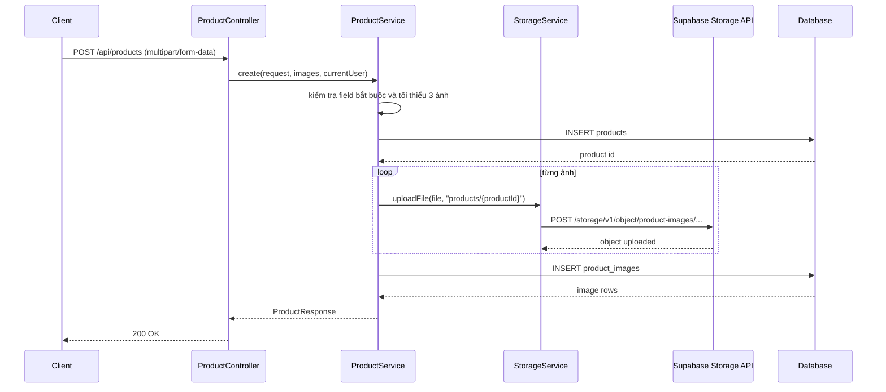
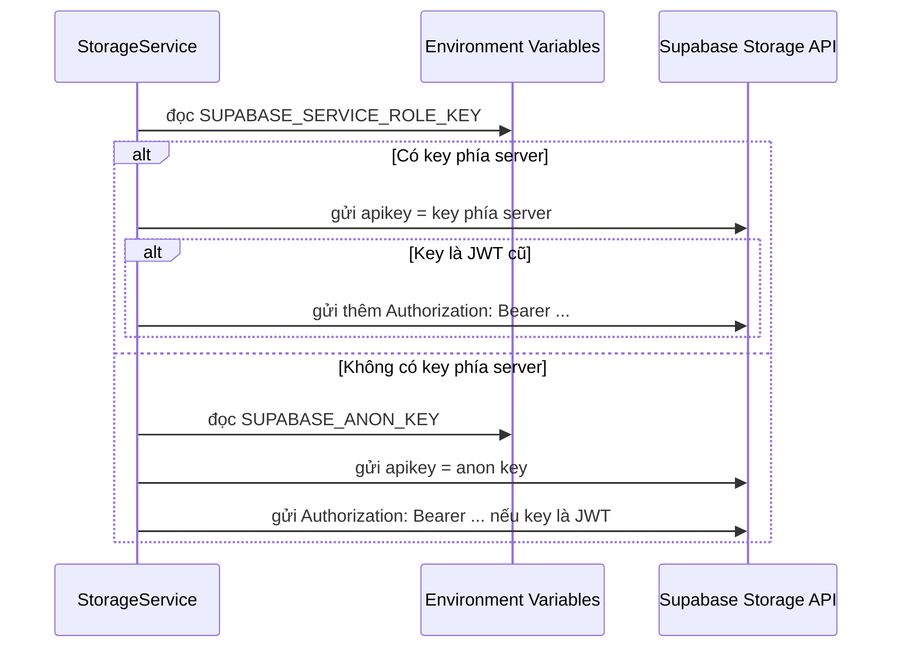
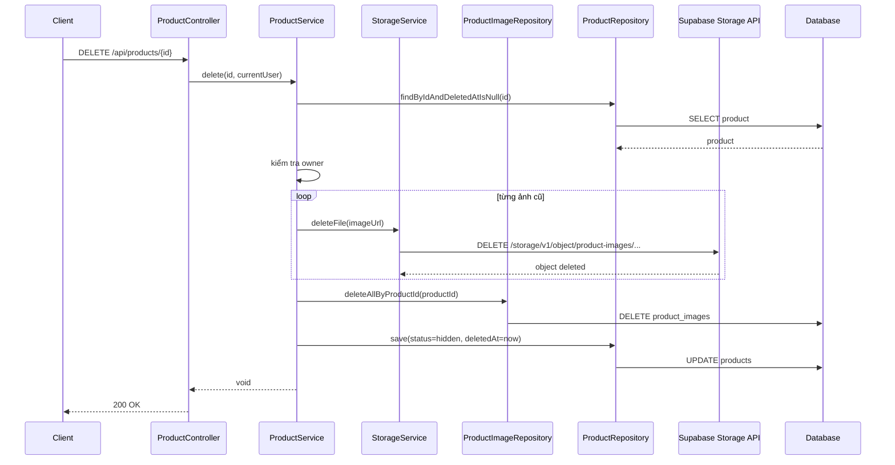

# Supabase Storage: Bucket, Policy, key phía server và luồng upload/xóa ảnh

## 1. Bối cảnh

Trong dự án này, backend Spring Boot dùng Supabase Storage để lưu ảnh sản phẩm.

Ban đầu API tạo product bị lỗi:

- `Bucket not found`

Sau khi tạo bucket, vẫn còn một câu hỏi rất quan trọng:

- tạo bucket xong thì upload đã chạy được ngay chưa?

Câu trả lời là:

- **chưa chắc**

Vì trong Supabase Storage, `bucket`, `policy`, và `key dùng để gọi API` là ba chuyện liên quan nhau nhưng không giống nhau.

## 2. Định nghĩa cơ bản

### Bucket là gì?

`Bucket` là nơi chứa file.

Bạn có thể hình dung:

- database có bảng để chứa dữ liệu
- storage có bucket để chứa file

Ví dụ:

- bucket `product-images` dùng để chứa ảnh của sản phẩm

### Policy là gì?

`Policy` là luật cho biết:

- ai được upload
- ai được xóa
- ai được xem

Nó giống như nội quy của một kho chứa file.

### API key là gì?

`API key` là chìa khóa để backend gọi sang Storage API.

Trong dự án này hiện có 2 loại giá trị liên quan:

- `SUPABASE_ANON_KEY`
- key phía server có quyền cao hơn

## 3. Tại sao tạo bucket xong vẫn chưa đủ?

Theo docs chính thức của Supabase:

- Storage dùng cơ chế kiểm soát truy cập trên `storage.objects`
- mặc định không phải cứ có bucket là upload được

Nghĩa là:

1. bạn có bucket rồi
2. nhưng nếu quyền chưa phù hợp
3. request upload vẫn có thể bị chặn

## 4. Bucket public có nghĩa là gì?

Đây là chỗ người mới hay hiểu nhầm.

`public bucket` **không có nghĩa là mọi thao tác đều public**.

Nó chủ yếu giúp:

- đọc file qua URL public dễ hơn
- frontend hiển thị ảnh dễ hơn

Nhưng các thao tác như:

- upload
- delete
- move

vẫn cần quyền phù hợp.

## 5. Luồng tạo product và upload ảnh



## 6. Giải thích luồng trên bằng ngôn ngữ dễ hiểu

### Bước 1: Client gửi request tạo product

Frontend gửi:

- thông tin sản phẩm
- các file ảnh

đến [ProductController.java](/e:/Old_bicycle_system/BE_old_bicycle_project/old_bicycle_project/src/main/java/com/backend/old_bicycle_project/controller/ProductController.java).

### Bước 2: Controller chuyển cho service

Controller không tự upload ảnh.

Nó gọi [ProductService.java](/e:/Old_bicycle_system/BE_old_bicycle_project/old_bicycle_project/src/main/java/com/backend/old_bicycle_project/service/ProductService.java).

### Bước 3: Service kiểm tra dữ liệu

Service kiểm tra:

- có `frameSize`
- có `wheelSize`
- có ít nhất 3 ảnh

Nếu thiếu, service dừng lại và báo lỗi.

### Bước 4: Service tạo product trước

Service lưu sản phẩm vào bảng `products` trước để có `productId`.

Lý do:

- đường dẫn upload ảnh đang dùng folder dạng `products/{productId}`

Nên phải có `productId` trước rồi mới upload file được.

### Bước 5: Service gọi `StorageService`

`ProductService` không tự gọi HTTP sang Supabase Storage.

Nó giao việc đó cho [StorageService.java](/e:/Old_bicycle_system/BE_old_bicycle_project/old_bicycle_project/src/main/java/com/backend/old_bicycle_project/service/StorageService.java).

Đây là cách tách trách nhiệm hợp lý:

- `ProductService` lo nghiệp vụ product
- `StorageService` lo upload/xóa file

## 7. Vì sao lần đầu lại lỗi `Bucket not found`?

Vì bucket `product-images` chưa tồn tại.

Lúc đó backend gọi API upload đúng đường dẫn, nhưng phía Supabase Storage trả về:

- bucket không có

Cho nên API tạo product bị fail ngay ở bước upload ảnh.

## 8. Sau khi tạo bucket thì còn phải làm gì?

Ở bước bootstrap, bucket `product-images` đã được tạo với:

- `public = true`
- giới hạn file `10MB`
- chỉ cho mime type ảnh phổ biến

Ngoài ra còn có policy tối thiểu để MVP chạy được.

Điều quan trọng ở đây là:

- bucket chỉ là nơi chứa file
- policy mới quyết định request nào được phép đi qua

## 9. Vì sao vẫn giữ `anon key` và thêm key phía server?

Bạn đã chốt:

- giữ `SUPABASE_ANON_KEY`
- đồng thời thêm key phía server để backend ưu tiên dùng khi có

Đây là hướng thực dụng vì:

- không làm gãy các phần đang phụ thuộc `anon key`
- nhưng backend server-side vẫn đi theo hướng an toàn hơn

## 10. Một điểm rất quan trọng về key mới của Supabase

Trước đây nhiều người quen với key dạng JWT cũ, ví dụ:

- chuỗi có 3 phần ngăn bởi dấu chấm `.`

Nhưng Supabase hiện còn có key mới dạng:

- `sb_secret_...`

Key này **không phải JWT**.

Nếu bạn nhét nó vào:

```text
Authorization: Bearer sb_secret_...
```

thì Storage API có thể báo lỗi:

- `Invalid Compact JWS`

## 11. Vì sao lại có lỗi `Invalid Compact JWS`?

Vì phía sau đang hiểu:

- `Authorization: Bearer ...` là chỗ dành cho JWT

Nhưng `sb_secret_...` không có cấu trúc JWT.

Cho nên phía server cố đọc nó như JWT và thất bại.

## 12. Cách sửa trong `StorageService`

`StorageService` đã được sửa theo nguyên tắc:

- luôn gửi `apikey`
- chỉ gửi `Authorization: Bearer ...` nếu key là JWT kiểu cũ

Nói dễ hiểu:

- với key mới `sb_secret_...`, ta dùng nó như API key
- với key JWT cũ, ta vẫn có thể dùng bearer auth

## 13. Luồng chọn key trong `StorageService`



## 14. Luồng xóa product và dọn ảnh khỏi storage



## 15. Vì sao delete product phải dọn cả storage?

Nếu chỉ soft-delete product mà không xóa object thật trong bucket thì sẽ có vấn đề:

- database nói sản phẩm đã ẩn
- nhưng file ảnh thật vẫn còn nằm trong storage

Như vậy sẽ sinh ra **file mồ côi**.

`File mồ côi` nghĩa là:

- file vẫn còn chiếm chỗ
- nhưng hệ thống không còn dùng nó nữa

Đó là lý do [ProductService.java](/e:/Old_bicycle_system/BE_old_bicycle_project/old_bicycle_project/src/main/java/com/backend/old_bicycle_project/service/ProductService.java) hiện đã:

1. xóa ảnh khỏi Supabase Storage
2. xóa metadata ảnh trong `product_images`
3. soft-delete product

## 16. Bài học rút ra cho người mới học

Khi làm việc với storage, bạn nên tách rõ 4 câu hỏi:

1. file sẽ được chứa ở đâu?
2. ai được phép upload/xóa/xem?
3. backend đang dùng loại key nào?
4. khi record trong database bị xóa hoặc ẩn thì file thật có được dọn không?

Nếu chỉ trả lời được câu 1 mà bỏ qua 3 câu còn lại, hệ thống rất dễ chạy nửa đúng nửa sai.
