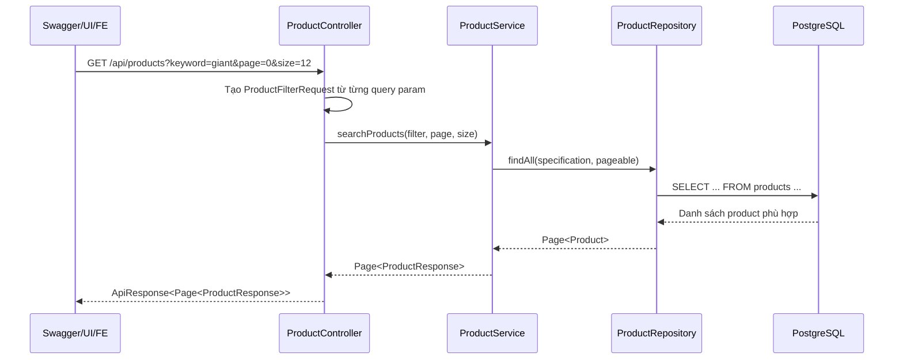

# Swagger Query Params Và `@ModelAttribute`

## Bối cảnh

Trong dự án này có API:

- `GET /api/products`

API này dùng để lấy danh sách xe cho người mua xem.

Ban đầu controller nhận một object:

```java
@ModelAttribute ProductFilterRequest filter
```

Về mặt chạy thật thì code này đúng. Spring vẫn bind được các query param vào `filter`.

Nhưng trong Swagger UI, endpoint lại bị hiển thị thành:

- một query param tên `filter`
- bên trong là một object JSON mẫu

Điều này rất dễ làm người dùng tưởng rằng:

1. `filter` là bắt buộc
2. phải điền hết các field trong object đó
3. có thể dán cả JSON object vào query

Thực tế thì không phải như vậy.

## Vì sao `Try it out` tự điền sẵn giá trị?

Swagger UI sẽ tự đổ dữ liệu mẫu vào ô input khi trong OpenAPI có:

- `example`
- hoặc `default`

Trong endpoint `GET /api/products`:

- các field lọc như `keyword`, `brandId`, `province`, `maxPrice` từng có `example`
- còn `page` và `size` có `defaultValue`

Vì vậy khi bấm `Try it out`:

- `page` và `size` vẫn tự có giá trị
- các field filter khác cũng bị đổ sẵn theo ví dụ mẫu

Khi người dùng bấm `Execute` mà không xóa các ô đó, request sẽ mang theo toàn bộ query param và làm kết quả bị lọc sai.

## `@ModelAttribute` là gì?

`@ModelAttribute` là cách để Spring gom nhiều query param hoặc form field vào một object Java.

Ví dụ:

```java
public ApiResponse<Page<ProductResponse>> searchProducts(
    @ModelAttribute ProductFilterRequest filter
)
```

Nếu client gửi:

```http
GET /api/products?keyword=giant&province=TP.HCM
```

thì Spring sẽ tự tạo:

```java
filter.setKeyword("giant");
filter.setProvince("TP.HCM");
```

Nghĩa là:

- `@ModelAttribute` rất tiện cho code backend
- nhưng chưa chắc Swagger hiển thị đẹp

## Vấn đề vì sao xuất hiện?

Trong lần hiển thị cũ, Swagger render `ProductFilterRequest` thành một object query.

Khi người dùng bấm `Try it out`, Swagger tạo URL kiểu:

```http
GET /api/products?keyword=string&brandId=...&categoryId=...&minPrice=0&maxPrice=0&province=string&hasInspection=true
```

Khi đó backend lọc thật theo các giá trị giả này.

Ví dụ:

- `province=string` sẽ tìm tỉnh tên `"string"`
- `maxPrice=0` sẽ chỉ lấy xe giá `<= 0`
- `hasInspection=true` sẽ chỉ lấy xe có inspection hợp lệ

Nên kết quả thường là:

```json
"content": []
```

Lỗi ở đây không phải do API hỏng.

Lỗi là do cách Swagger làm người dùng nhập query sai.

## Cách sửa trong dự án này

Thay vì để controller nhận trực tiếp:

```java
@ModelAttribute ProductFilterRequest filter
```

controller bây giờ nhận từng `@RequestParam` riêng:

```java
@RequestParam(required = false) String keyword,
@RequestParam(required = false) UUID brandId,
@RequestParam(required = false) UUID categoryId,
...
```

Sau đó controller tự dựng lại `ProductFilterRequest`:

```java
ProductFilterRequest filter = new ProductFilterRequest();
filter.setKeyword(keyword);
filter.setBrandId(brandId);
filter.setCategoryId(categoryId);
...
```

### Vì sao cách này tốt hơn?

Vì Swagger sẽ hiển thị đúng từng query param riêng lẻ:

- `keyword`
- `brandId`
- `categoryId`
- `page`
- `size`

Người dùng nhìn vào sẽ hiểu ngay:

- để trống thì không lọc
- chỉ điền field nào thật sự cần

## Luồng chạy end-to-end



## Giải thích lại theo kiểu dễ hiểu

1. Client gửi request lên backend.
2. Controller đọc từng query param như `keyword`, `categoryId`, `minPrice`.
3. Controller gom chúng lại thành `ProductFilterRequest`.
4. Service dùng object này để tạo điều kiện lọc.
5. Repository query xuống database.
6. Database trả dữ liệu phù hợp.
7. Backend trả lại danh sách xe cho client.

Điểm mới ở lần sửa này là:

- **luồng business không đổi**
- chỉ đổi **cách viết controller để Swagger hiển thị rõ hơn**
- đồng thời bỏ `example` khỏi các field filter tùy chọn để Swagger không còn tự điền sẵn các giá trị đó

## Ví dụ dùng đúng

Lấy tất cả xe công khai:

```http
GET /api/products?page=0&size=12
```

Lọc nhẹ theo từ khóa:

```http
GET /api/products?keyword=giant&page=0&size=12
```

Lọc theo danh mục và khoảng giá:

```http
GET /api/products?categoryId=<uuid>&minPrice=10000000&maxPrice=30000000&page=0&size=12
```

## Hiểu lầm thường gặp

### 1. Thấy object `filter` trong Swagger thì tưởng bắt buộc

Không đúng.

Nó chỉ là cách Swagger render chưa đẹp.

### 2. Tưởng phải điền hết tất cả field

Không đúng.

Hầu hết field lọc đều là tùy chọn.

### 3. Tưởng API rỗng là do seed lỗi

Không phải lúc nào cũng vậy.

Nhiều khi chỉ là vì người dùng gửi:

- `province=string`
- `maxPrice=0`
- `hasInspection=true`

nên backend lọc ra rỗng.

## File liên quan trong dự án

- [ProductController.java](/e:/Old_bicycle_system/BE_old_bicycle_project/old_bicycle_project/src/main/java/com/backend/old_bicycle_project/controller/ProductController.java)
- [ProductFilterRequest.java](/e:/Old_bicycle_system/BE_old_bicycle_project/old_bicycle_project/src/main/java/com/backend/old_bicycle_project/dto/product/ProductFilterRequest.java)
- [ProductService.java](/e:/Old_bicycle_system/BE_old_bicycle_project/old_bicycle_project/src/main/java/com/backend/old_bicycle_project/service/ProductService.java)
- [ProductSpecification.java](/e:/Old_bicycle_system/BE_old_bicycle_project/old_bicycle_project/src/main/java/com/backend/old_bicycle_project/specification/ProductSpecification.java)

## Kết luận

Lần sửa này không phải để đổi logic tìm kiếm sản phẩm.

Mục tiêu chính là:

- làm Swagger dễ hiểu hơn
- giảm khả năng người dùng test sai
- giúp FE và QA nhìn contract API rõ ràng hơn
