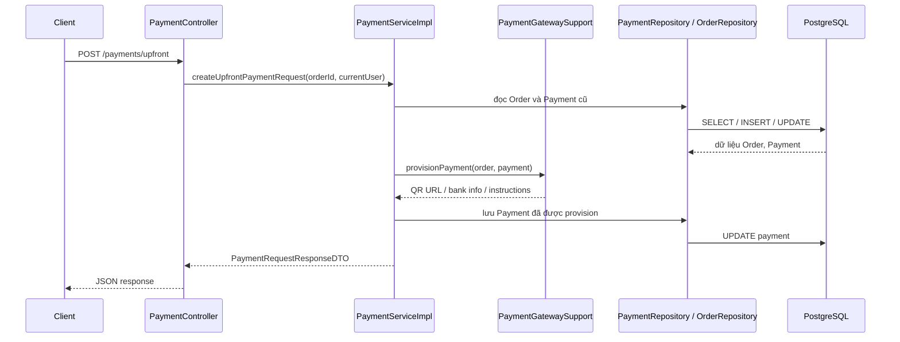

# Thin Service Refactor cho Payment, Payout, Order

## 1. Bối cảnh

Trong backend của dự án này, ba file service từng rất dài là:

- `src/main/java/com/backend/old_bicycle_project/service/impl/PaymentServiceImpl.java`
- `src/main/java/com/backend/old_bicycle_project/service/impl/PayoutServiceImpl.java`
- `src/main/java/com/backend/old_bicycle_project/service/impl/OrderServiceImpl.java`

Khi một file service quá dài, sinh viên rất dễ gặp ba vấn đề:

1. Khó đọc vì một file chứa quá nhiều trách nhiệm khác nhau.
2. Khó test vì khi lỗi xảy ra, không biết lỗi nằm ở phần nào.
3. Khó bảo trì vì sửa một chỗ rất dễ làm ảnh hưởng chỗ khác.

Lần refactor này không đổi business rule. Mục tiêu chỉ là tách trách nhiệm cho rõ hơn.

## 2. Khái niệm “thin service”

### Định nghĩa

`Thin service` có thể hiểu đơn giản là:

- file service chính vẫn là nơi điều phối luồng nghiệp vụ
- nhưng các chi tiết kỹ thuật được tách ra các class nhỏ hơn

Nói ngắn gọn:

- service chính lo `orchestration`
- class phụ lo `implementation detail`

### Vì sao quan trọng

Nếu service vừa:

- kiểm tra quyền
- xử lý trạng thái
- parse JSON
- gọi cổng thanh toán
- tạo notification
- map DTO

thì file đó sẽ phình ra rất nhanh.

Tách thành nhiều class nhỏ giúp:

- mỗi class có một trách nhiệm chính
- đọc code theo cụm chức năng dễ hơn
- test fail thì khoanh vùng nhanh hơn
- giảm rủi ro sửa nhầm logic không liên quan

## 3. Ví dụ rất nhỏ

### Trước

Một file service chứa cả:

- gọi API SePay
- parse webhook
- cập nhật order
- tạo financial transaction
- publish notification

### Sau

Ta tách ra như sau:

- `PaymentServiceImpl`: điều phối
- `PaymentGatewaySupport`: lo gọi gateway
- `PaymentWebhookSupport`: lo parse webhook
- `PaymentSettlementSupport`: lo cập nhật payment/order/refund/notification

Ý tưởng này cũng được áp dụng tương tự cho `PayoutServiceImpl` và `OrderServiceImpl`.

## 4. Áp dụng trong dự án này

### Payment

Các file mới:

- `src/main/java/com/backend/old_bicycle_project/service/impl/PaymentGatewaySupport.java`
- `src/main/java/com/backend/old_bicycle_project/service/impl/PaymentWebhookSupport.java`
- `src/main/java/com/backend/old_bicycle_project/service/impl/PaymentSettlementSupport.java`
- `src/main/java/com/backend/old_bicycle_project/service/impl/PaymentSupportUtils.java`
- `src/main/java/com/backend/old_bicycle_project/service/impl/PaymentSupportModels.java`

Phân vai:

- `PaymentServiceImpl` giữ các API chính như `createUpfrontPaymentRequest`, `handleSepayWebhook`, `expireOverdueUpfrontPayments`
- `PaymentGatewaySupport` lo phần SePay, QR, static transfer, live order
- `PaymentWebhookSupport` lo xác thực webhook và tìm `gatewayOrderCode`
- `PaymentSettlementSupport` lo cập nhật `Payment`, `Order`, `RefundRequest`, `FinancialTransaction`, notification

### Payout

Các file mới:

- `src/main/java/com/backend/old_bicycle_project/service/impl/PayoutNotificationSupport.java`
- `src/main/java/com/backend/old_bicycle_project/service/impl/PayoutWorkflowSupport.java`
- `src/main/java/com/backend/old_bicycle_project/service/impl/PayoutExecutionSupport.java`
- `src/main/java/com/backend/old_bicycle_project/service/impl/PayoutSupportUtils.java`

Phân vai:

- `PayoutServiceImpl` giữ API public của service
- `PayoutWorkflowSupport` lo tạo payout, đồng bộ payout với profile, hydrate payout đang chờ
- `PayoutExecutionSupport` lo hoàn tất refund payout và seller payout
- `PayoutNotificationSupport` lo gửi notification cho buyer, seller, admin

### Order

Các file mới:

- `src/main/java/com/backend/old_bicycle_project/service/impl/OrderTransitionSupport.java`
- `src/main/java/com/backend/old_bicycle_project/service/impl/OrderViewSupport.java`

Phân vai:

- `OrderServiceImpl` giữ các use case như tạo order, accept, confirm deposit, complete, confirm received, cancel
- `OrderTransitionSupport` lo validate vai trò, lock product, expire payment, reject competing orders, gửi notification
- `OrderViewSupport` lo map `Order -> OrderResponseDTO` và gom evidence/review

## 5. Luồng end-to-end sau khi refactor

Ví dụ với payment request:

### Giải thích lại bằng lời rất đơn giản

1. Client gửi request lên controller.
2. Controller không tự xử lý nghiệp vụ mà gọi xuống service.
3. `PaymentServiceImpl` là nơi quyết định luồng lớn.
4. Khi cần logic kỹ thuật riêng, service gọi class phụ như `PaymentGatewaySupport`.
5. Repository đọc hoặc ghi dữ liệu vào PostgreSQL.
6. Kết quả cuối cùng được đóng gói thành DTO và trả về client.

Điểm quan trọng là:

- luồng HTTP không đổi
- business rule không đổi
- chỉ đổi cách tổ chức code bên trong service

## 6. Trước và sau refactor

### Trước

- một file service ôm quá nhiều việc
- đọc rất mệt
- khó giải thích khi bảo vệ

### Sau

- service chính ngắn hơn và dễ nhìn hơn
- class phụ thể hiện đúng trách nhiệm
- có thể giải thích từng lớp rõ ràng cho giảng viên

Ví dụ line count sau refactor:

- `PaymentServiceImpl`: khoảng `269` dòng
- `PayoutServiceImpl`: khoảng `211` dòng
- `OrderServiceImpl`: khoảng `330` dòng

## 7. Những hiểu lầm sinh viên hay gặp

### Hiểu lầm 1: Tách file là đổi nghiệp vụ

Không đúng.

Refactor tốt là:

- đổi cấu trúc code
- nhưng không đổi hành vi business

### Hiểu lầm 2: Càng ít file càng tốt

Không đúng.

Nếu một file quá dài và chứa nhiều trách nhiệm, ít file lại là điểm yếu.

### Hiểu lầm 3: Service phải tự làm tất cả

Không đúng.

Service nên là nơi điều phối.

Những phần kỹ thuật chuyên biệt như:

- parse webhook
- build QR URL
- publish notification
- map DTO

nên được tách ra thành class phụ để code dễ đọc hơn.

## 8. Vì sao refactor này an toàn

Các điểm giúp giảm rủi ro:

1. Không đổi tên method public của service.
2. Giữ nguyên constructor dependency theo hướng tương thích với test hiện có.
3. Chạy lại test mục tiêu:
   - `PaymentServiceImplTest`
   - `PayoutServiceImplTest`
   - `OrderServiceImplTest`

Điều này rất quan trọng khi bảo vệ đồ án, vì em có thể nói:

> Em không chỉ tách file cho đẹp, mà em còn giữ nguyên hành vi cũ bằng test hồi quy.

## 9. Cách trình bày với giảng viên

Nếu giảng viên hỏi:

`Vì sao em tách nhiều class như vậy?`

Em có thể trả lời ngắn gọn:

`Vì mỗi service trước đây ôm quá nhiều trách nhiệm. Em refactor theo hướng thin service, nghĩa là service chính chỉ điều phối luồng nghiệp vụ, còn các phần kỹ thuật chuyên biệt như gateway, webhook, notification, mapping được tách ra class riêng. Cách này giúp code dễ đọc, dễ test, dễ bảo trì, nhưng không làm thay đổi business rule hay API contract.`

## 10. Bài học rút ra

Một service backend tốt không chỉ cần chạy đúng.

Nó còn cần:

- dễ đọc
- dễ giải thích
- dễ test
- dễ mở rộng

Refactor theo hướng `thin service + support classes` là một cách rất thực tế để đạt điều đó trong dự án Spring Boot.
