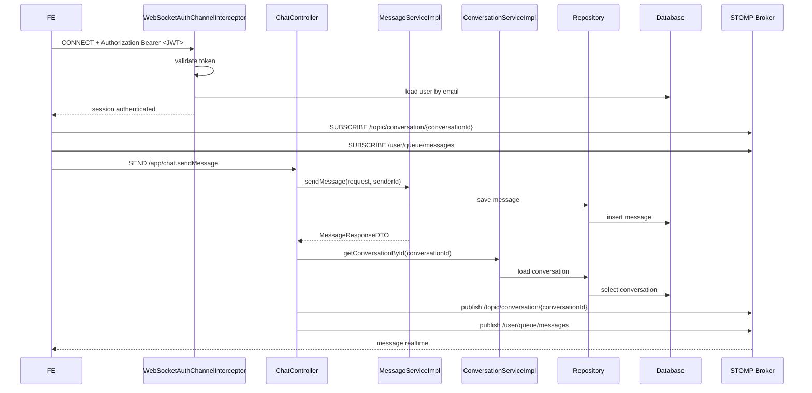

# WebSocket, STOMP, JWT Và Chat Realtime Cho Người Mới Học

## Bối cảnh

Trong project này, chat không chỉ dùng REST API.

Nó dùng thêm:

- `WebSocket`
- `STOMP`
- `JWT`

để gửi tin nhắn theo thời gian thực.

Nếu chỉ nhìn code một lúc, người mới rất dễ bị rối vì thấy vừa có:

- `GET /api/conversations/me`
- `GET /api/conversations/{id}/messages`
- `PUT /api/conversations/{id}/read`
- `@MessageMapping("/chat.sendMessage")`
- `WebSocketAuthChannelInterceptor`
- `SimpMessagingTemplate`

Note này giải thích từng phần một cách chậm và rõ.

## WebSocket là gì?

`WebSocket` là một kết nối lâu dài giữa client và server.

Khác với HTTP bình thường:

- HTTP thường là gửi request xong rồi đóng
- WebSocket là mở kết nối, rồi hai bên có thể gửi dữ liệu qua lại nhiều lần trên cùng kết nối đó

Điều này rất hợp với:

- chat realtime
- thông báo realtime
- game realtime
- dashboard cần cập nhật liên tục

## Vì sao chat hay dùng WebSocket?

Với chat, nếu chỉ dùng HTTP polling:

- FE phải gọi API liên tục để hỏi “có tin nhắn mới chưa?”
- vừa chậm, vừa tốn tài nguyên

Với WebSocket:

- backend có thể đẩy tin nhắn mới xuống ngay
- người dùng thấy tin nhắn xuất hiện gần như tức thời

## STOMP là gì?

`STOMP` là một giao thức nhắn tin chạy trên WebSocket.

Hiểu đơn giản:

- WebSocket giống như cái ống truyền dữ liệu
- STOMP giống như cách tổ chức thư từ chạy bên trong cái ống đó

STOMP có các khái niệm quen thuộc:

- `CONNECT`
- `SUBSCRIBE`
- `SEND`

Nó giúp FE và BE nói chuyện có cấu trúc hơn thay vì tự bịa format raw text.

## JWT là gì trong luồng WebSocket?

`JWT` là token xác thực.

Trong project này:

- REST API protected dùng `Authorization: Bearer <token>`
- WebSocket STOMP cũng dùng cùng token đó ở frame `CONNECT`

Backend sẽ đọc token này để biết:

- ai đang kết nối
- user đó có hợp lệ không

## Những kiến thức quan trọng về WebSocket cần nhớ

### 1. WebSocket không thay thế hết REST API

Đây là điểm rất quan trọng.

Trong project này:

- REST API dùng để lấy danh sách conversation, lịch sử message, đánh dấu đã đọc
- WebSocket dùng để đẩy message mới theo thời gian thực

Nghĩa là:

- REST và WebSocket **đi cùng nhau**
- không phải chọn một bỏ một

### 2. Kết nối WebSocket phải được xác thực

Nếu backend không kiểm tra JWT khi `CONNECT`, người lạ có thể:

- kết nối vào hệ thống chat
- gửi message giả
- subscribe nhầm queue của người khác

Vì vậy project này dùng:

- [WebSocketAuthChannelInterceptor.java](/e:/Old_bicycle_system/BE_old_bicycle_project/old_bicycle_project/src/main/java/com/backend/old_bicycle_project/security/WebSocketAuthChannelInterceptor.java)

để chặn ngay từ đầu.

### 3. Cần hiểu sự khác nhau giữa topic chung và queue riêng

Trong project này có hai kiểu destination quan trọng:

- `/topic/conversation/{conversationId}`
  - dùng cho màn chat đang mở
  - ai subscribe conversation đó sẽ nhận được message mới
- `/user/queue/messages`
  - dùng như queue riêng của từng user
  - phục vụ unread badge hoặc global notification cập nhật chat

### 4. WebSocket chỉ đẩy message mới, không tự sinh lịch sử

Nếu user reload trang:

- FE vẫn phải gọi REST để lấy lịch sử cũ
- WebSocket chỉ giúp nhận phần mới phát sinh sau khi đã kết nối

### 5. Reconnect là chuyện bình thường

WebSocket có thể bị rớt vì:

- mạng yếu
- đổi mạng
- refresh browser
- ngrok/staging restart

Nên FE phải có chiến lược:

- reconnect
- resubscribe
- đồng bộ lại unread/message list bằng REST nếu cần

## Project này tích hợp WebSocket như thế nào?

## Các file chính

- [WebSocketConfig.java](/e:/Old_bicycle_system/BE_old_bicycle_project/old_bicycle_project/src/main/java/com/backend/old_bicycle_project/config/WebSocketConfig.java)
- [WebSocketAuthChannelInterceptor.java](/e:/Old_bicycle_system/BE_old_bicycle_project/old_bicycle_project/src/main/java/com/backend/old_bicycle_project/security/WebSocketAuthChannelInterceptor.java)
- [ChatController.java](/e:/Old_bicycle_system/BE_old_bicycle_project/old_bicycle_project/src/main/java/com/backend/old_bicycle_project/controller/ChatController.java)
- [MessageServiceImpl.java](/e:/Old_bicycle_system/BE_old_bicycle_project/old_bicycle_project/src/main/java/com/backend/old_bicycle_project/service/impl/MessageServiceImpl.java)
- [ConversationServiceImpl.java](/e:/Old_bicycle_system/BE_old_bicycle_project/old_bicycle_project/src/main/java/com/backend/old_bicycle_project/service/impl/ConversationServiceImpl.java)

## WebSocketConfig làm gì?

[WebSocketConfig.java](/e:/Old_bicycle_system/BE_old_bicycle_project/old_bicycle_project/src/main/java/com/backend/old_bicycle_project/config/WebSocketConfig.java) cấu hình:

- endpoint kết nối: `/ws`
- application prefix: `/app`
- broker prefixes:
  - `/topic`
  - `/queue`
- user destination prefix: `/user`

Điều đó có nghĩa:

- FE connect vào `/ws`
- FE gửi message tới `/app/chat.sendMessage`
- backend publish ra `/topic/...` hoặc `/user/...`

## WebSocketAuthChannelInterceptor làm gì?

[WebSocketAuthChannelInterceptor.java](/e:/Old_bicycle_system/BE_old_bicycle_project/old_bicycle_project/src/main/java/com/backend/old_bicycle_project/security/WebSocketAuthChannelInterceptor.java) là lớp đứng chặn ở inbound channel.

Nó xử lý như sau:

1. Nếu frame là `CONNECT`
   - đọc header `Authorization` hoặc `authorization`
   - kiểm tra phải có `Bearer <token>`
   - validate JWT
   - trích email từ token
   - tìm user trong database
   - gắn `Principal` vào session WebSocket
2. Nếu frame là `SEND`, `SUBSCRIBE`, `UNSUBSCRIBE`
   - nếu chưa có user hợp lệ thì chặn

Nghĩa là backend không tin client ngay. Backend chỉ tin session đã được xác thực.

## ChatController làm gì?

[ChatController.java](/e:/Old_bicycle_system/BE_old_bicycle_project/old_bicycle_project/src/main/java/com/backend/old_bicycle_project/controller/ChatController.java) có hai phần:

### 1. REST API

- `GET /api/conversations/me`
- `POST /api/conversations?productId=...`
- `GET /api/conversations/{conversationId}/messages?page=&size=`
- `PUT /api/conversations/{conversationId}/read`

### 2. WebSocket endpoint

- `@MessageMapping("/chat.sendMessage")`

Đây là method xử lý khi FE gửi STOMP `SEND` tới `/app/chat.sendMessage`.

## Luồng thực tế của chat realtime



## Giải thích lại bằng lời đơn giản

1. FE đăng nhập trước để có JWT.
2. FE mở kết nối STOMP tới `/ws` và gửi JWT trong frame `CONNECT`.
3. Interceptor kiểm tra token.
4. Nếu token hợp lệ, session WebSocket được gắn với user thật.
5. FE subscribe:
   - một channel conversation cụ thể
   - một queue riêng của user
6. Khi FE gửi tin nhắn mới:
   - backend lấy `senderId` từ `Principal`
   - backend lưu message vào database
   - backend tìm recipient
   - backend broadcast lại ra broker
7. FE nhận message mới ngay mà không cần polling liên tục.

## Mối liên quan giữa REST API và WebSocket

### REST API nào liên quan?

| API | Vai trò |
| --- | --- |
| `POST /api/conversations?productId=...` | tạo hoặc lấy conversation trước khi chat |
| `GET /api/conversations/me` | lấy danh sách conversation |
| `GET /api/conversations/{conversationId}/messages` | lấy lịch sử message |
| `PUT /api/conversations/{conversationId}/read` | đánh dấu đã đọc |

### WebSocket nào liên quan?

- connect vào `/ws`
- send tới `/app/chat.sendMessage`
- subscribe:
  - `/topic/conversation/{conversationId}`
  - `/user/queue/messages`

## Quan hệ giữa chúng

REST lo phần:

- đồng bộ dữ liệu nền
- lấy dữ liệu cũ
- đánh dấu read
- dựng UI lần đầu

WebSocket lo phần:

- đẩy message mới
- cập nhật realtime

Nếu FE chỉ dùng WebSocket mà không gọi REST:

- sẽ thiếu lịch sử cũ
- reload trang xong sẽ không biết conversation nào tồn tại

Nếu FE chỉ dùng REST mà không dùng WebSocket:

- chat sẽ không realtime

## FE cần tích hợp như thế nào?

### Bước 1. Login lấy JWT

FE gọi:

- `POST /api/auth/login`

Sau khi có `accessToken`, FE lưu token vào auth store.

### Bước 2. Vào màn chat

FE nên:

1. gọi `GET /api/conversations/me`
2. nếu user mở chat từ product detail, gọi `POST /api/conversations?productId=...`
3. gọi `GET /api/conversations/{id}/messages`
4. rồi mới mở WebSocket/STOMP

### Bước 3. Connect STOMP

FE connect tới `/ws` với header:

```text
Authorization: Bearer <accessToken>
```

### Bước 4. Subscribe

FE subscribe:

- `/topic/conversation/{conversationId}`
- `/user/queue/messages`

### Bước 5. Send message

FE gửi:

```json
{
  "conversationId": "uuid",
  "content": "xin chào",
  "imageUrl": null
}
```

tới:

```text
/app/chat.sendMessage
```

## FE cần lưu ý gì?

### 1. Không tự tin vào `senderId`

`MessageRequestDTO` có field `senderId`, nhưng FE không nên dựa vào đó.

Trong project này, backend lấy người gửi thật từ `Principal`.

### 2. Phải handle reconnect

Nếu socket rớt:

- reconnect
- subscribe lại
- có thể reload message bằng REST nếu cần

### 3. Cần kết hợp unread badge với REST

`/user/queue/messages` giúp cập nhật nhanh.

Nhưng khi user mở lại app hoặc reload:

- vẫn nên sync unread/count hoặc conversation list bằng REST

### 4. Cần phân biệt “message đến conversation đang mở” và “message mới ở conversation khác”

- `/topic/conversation/{id}` phù hợp cho cửa sổ chat đang mở
- `/user/queue/messages` phù hợp cho global badge/notification

### 5. Nên xử lý optimistic UI cẩn thận

FE có thể render message tạm thời trước cho mượt, nhưng vẫn phải chấp nhận message thật từ server để:

- lấy `id` thật
- lấy `createdAt` thật
- tránh lệch state

## Khó khăn khi tích hợp FE là gì?

### Mức độ khó

Khó hơn CRUD REST bình thường.

Lý do:

- có state của socket
- có reconnect
- có subscribe/unsubscribe
- có unread/read sync
- có đồng bộ giữa REST và realtime

### Những lỗi FE hay gặp

1. connect socket nhưng quên gửi JWT
2. subscribe sai path
3. chỉ subscribe `/topic/...` mà quên `/user/queue/messages`
4. không unsubscribe khi đổi conversation
5. reload trang xong quên gọi REST để lấy lịch sử
6. badge unread bị lệch vì chỉ tin socket, không sync lại

## Áp dụng cụ thể trong project này

### File backend chính

- cấu hình socket:
  - [WebSocketConfig.java](/e:/Old_bicycle_system/BE_old_bicycle_project/old_bicycle_project/src/main/java/com/backend/old_bicycle_project/config/WebSocketConfig.java)
- xác thực JWT cho STOMP:
  - [WebSocketAuthChannelInterceptor.java](/e:/Old_bicycle_system/BE_old_bicycle_project/old_bicycle_project/src/main/java/com/backend/old_bicycle_project/security/WebSocketAuthChannelInterceptor.java)
- REST + realtime controller:
  - [ChatController.java](/e:/Old_bicycle_system/BE_old_bicycle_project/old_bicycle_project/src/main/java/com/backend/old_bicycle_project/controller/ChatController.java)
- lưu message:
  - [MessageServiceImpl.java](/e:/Old_bicycle_system/BE_old_bicycle_project/old_bicycle_project/src/main/java/com/backend/old_bicycle_project/service/impl/MessageServiceImpl.java)

### Điều đã được siết thêm bằng regression

Trong tranche gần đây, backend đã có regression cho:

- lowercase `authorization`
- invalid token
- unknown user
- unauthenticated `SUBSCRIBE`
- user ngoài conversation không được mark read
- route message tới đúng recipient queue

Điều này giúp FE tích hợp rõ ràng hơn, vì các sai lệch thường gặp đã được backend chặn tốt hơn.

## Kết luận

- `WebSocket` là kênh realtime hai chiều lâu dài.
- `STOMP` là cách tổ chức tin nhắn chạy trên WebSocket.
- `JWT` dùng để xác thực session STOMP.
- Trong project này, REST và WebSocket phải đi cùng nhau.
- Luồng chuẩn là:
  - login lấy JWT
  - REST lấy conversation/history
  - connect `/ws`
  - subscribe đúng channel
  - gửi message qua `/app/chat.sendMessage`
  - nhận realtime qua `/topic/...` và `/user/queue/messages`

Nếu hiểu đúng mối quan hệ giữa:

- REST
- WebSocket
- STOMP
- JWT

thì phần chat realtime sẽ bớt “ma thuật” và dễ debug hơn rất nhiều.
