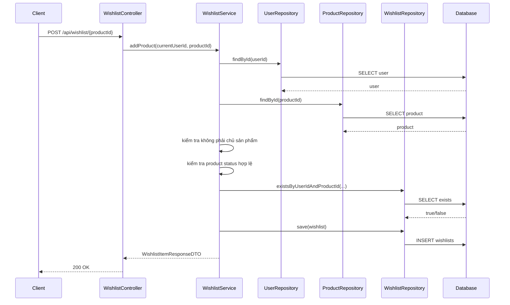
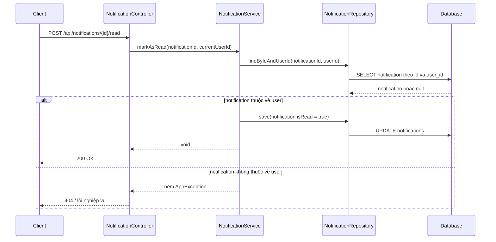

# De-scope MVP và Regression Test Cơ Bản Cho Wishlist / Notification

Ngày cập nhật: 2026-03-13  
Phạm vi: giải thích vì sao dự án bỏ video khỏi MVP hiện tại, và vì sao sau đó lại ưu tiên viết test cho `wishlist` và `notification`.

## 1. Bối cảnh

Sau khi rà lại tiến độ backend, nhóm đã chốt một quyết định quan trọng:

- **video vẫn có trong SRS**
- nhưng **không đưa vào MVP hiện tại**

Lý do là vì video kéo theo quá nhiều việc phụ:

- upload file lớn
- lưu trữ media
- filter `hasVideo`
- hiển thị video ở detail page
- kiểm thử và moderation phức tạp hơn

Trong khi đó, các luồng như:

- thêm sản phẩm vào wishlist
- gửi notification
- đánh dấu notification đã đọc
- tạo payment request

lại là các phần gần với MVP hơn và cần chắc tay hơn.

Cho nên thay vì làm rộng thêm, backend chọn cách:

1. giảm bớt scope chưa cần thiết
2. viết thêm regression tests cho các flow MVP đang có

## 2. Các khái niệm cần hiểu trước

### MVP là gì?

`MVP` là viết tắt của `Minimum Viable Product`.

Hiểu đơn giản:

- đây là phiên bản nhỏ nhất của sản phẩm
- nhưng vẫn đủ để chạy được bài toán chính

Ví dụ với dự án này, lõi của MVP sẽ gần với:

- đăng ký / đăng nhập
- đăng tin
- tìm kiếm
- chat
- order / payment cơ bản
- notification

### De-scope là gì?

`De-scope` nghĩa là **tạm thời đưa một phần tính năng ra khỏi phạm vi triển khai hiện tại**.

Điều này **không có nghĩa là tính năng đó sai hoặc không còn tồn tại**.

Nó chỉ có nghĩa là:

- tính năng đó chưa làm ở giai đoạn này
- nhóm sẽ tập trung nguồn lực vào phần quan trọng hơn trước

### Regression test là gì?

`Regression test` là test giúp kiểm tra xem:

- sau khi sửa code hoặc thêm feature
- những phần cũ có bị hỏng theo không

Ví dụ:

- hôm qua API wishlist chạy đúng
- hôm nay bạn sửa payment
- regression test giúp đảm bảo wishlist không tự nhiên hỏng vì thay đổi mới

## 3. Vì sao bỏ video rồi lại viết test?

Vì khi một dự án đã nhiều module, rủi ro lớn nhất không còn là “thiếu file”.

Rủi ro lớn hơn là:

- sửa chỗ này làm hỏng chỗ khác
- luồng đang dùng được nhưng không ai kiểm tra lại
- người dùng gặp lỗi ở các chức năng tưởng như đơn giản

Nên quyết định đúng trong giai đoạn này là:

- **không mở rộng bừa**
- **làm cho phần MVP đang có trở nên ổn định hơn**

## 4. Luồng thêm sản phẩm vào wishlist

## 5. Giải thích luồng wishlist theo cách dễ hiểu

### Bước 1: client gửi request

Người dùng bấm “thêm vào wishlist”.

Frontend gọi API.

### Bước 2: controller nhận request

`WishlistController` không tự viết luật nghiệp vụ.

Nó chỉ:

- nhận request
- lấy `currentUser`
- chuyển việc cho service

### Bước 3: service xử lý luật nghiệp vụ

`WishlistServiceImpl` sẽ kiểm tra:

- user có tồn tại không
- product có tồn tại không
- người thêm có phải là chính seller không
- product có ở trạng thái được phép thêm wishlist không
- đã thêm trước đó chưa

Đây là phần quan trọng nhất của business logic.

### Bước 4: repository nói chuyện với database

Repository có nhiệm vụ:

- tìm user
- tìm product
- kiểm tra wishlist đã tồn tại chưa
- lưu wishlist mới

Repository không tự quyết định luật “seller có được tự thêm sản phẩm của mình không”.

Luật đó là việc của service.

### Bước 5: response trả về cho client

Nếu mọi thứ hợp lệ, backend trả về:

- id sản phẩm
- tiêu đề
- giá
- seller
- ảnh chính
- thời điểm thêm vào wishlist

## 6. Vì sao phải viết test cho wishlist?

Vì wishlist trông có vẻ đơn giản, nhưng thực ra có nhiều rule nhỏ dễ hỏng:

- không cho seller tự wishlist sản phẩm của mình
- không cho thêm trùng
- chỉ cho thêm khi product đang ở trạng thái hợp lệ
- phải map đúng ảnh chính

Nếu không có test, sau này rất dễ xảy ra chuyện:

- sửa query hoặc DTO
- wishlist vẫn compile
- nhưng dữ liệu trả ra sai

## 7. Luồng đánh dấu notification là đã đọc

## 8. Vì sao notification phải kiểm tra ownership?

`Ownership` nghĩa là quyền sở hữu dữ liệu.

Trong bài toán này:

- notification của ai thì chỉ người đó được đọc / đánh dấu đã đọc

Nếu backend chỉ nhận `notificationId` rồi update bừa, sẽ xảy ra lỗi:

- user A có thể đánh dấu notification của user B là đã đọc

Đó là lỗi bảo mật dữ liệu.

Cho nên service phải tìm theo:

- `notificationId`
- `userId`

cùng lúc.

Nếu không tìm thấy bản ghi khớp cả hai điều kiện, backend phải từ chối.

## 9. Regression test đã bảo vệ điều gì?

Trong lượt sửa này, test mới đang bảo vệ các ý sau:

### Wishlist

- thêm wishlist thành công trả ra đúng dữ liệu
- seller không được wishlist sản phẩm của chính mình
- user không tồn tại thì bị chặn
- remove flow gọi đúng repository delete

### Notification

- gửi notification sẽ:
  - lưu xuống database
  - push qua WebSocket private queue
- mark-as-read sẽ chặn notification không thuộc user
- unread count trả đúng số lượng từ repository

### Payment

- live mode không được chạy khi thiếu cấu hình SePay quan trọng
- webhook live mode không được phép bỏ trống key xác thực

## 10. Ánh xạ sang file code thật

- Wishlist service:
  - `src/main/java/com/backend/old_bicycle_project/service/impl/WishlistServiceImpl.java`
- Notification service:
  - `src/main/java/com/backend/old_bicycle_project/service/impl/NotificationServiceImpl.java`
- Payment service:
  - `src/main/java/com/backend/old_bicycle_project/service/impl/PaymentServiceImpl.java`
- Wishlist tests:
  - `src/test/java/com/backend/old_bicycle_project/service/impl/WishlistServiceImplTest.java`
- Notification tests:
  - `src/test/java/com/backend/old_bicycle_project/service/impl/NotificationServiceImplTest.java`
- Payment tests:
  - `src/test/java/com/backend/old_bicycle_project/service/impl/PaymentServiceImplTest.java`

## 11. Lỗi người mới học hay gặp

### Lỗi 1: Nghĩ rằng bỏ một feature ra khỏi sprint là “làm dở”

Không hẳn.

Nếu feature đó chưa cần thiết và đang làm loãng tiến độ, de-scope là quyết định tốt.

### Lỗi 2: Nghĩ rằng đã có controller rồi thì module đã ổn

Không đúng.

Controller chỉ là cửa nhận request.

Flow chỉ thật sự ổn khi:

- service có luật đúng
- repository đọc/ghi đúng
- response đúng
- có test bảo vệ

### Lỗi 3: Chỉ test đường thành công

Rất nhiều bug nằm ở đường lỗi:

- sai ownership
- thiếu config
- dữ liệu không tồn tại

Nên test đường lỗi quan trọng không kém đường thành công.

## 12. Câu chốt dễ nhớ

Khi dự án đã có nhiều module, cách tiến nhanh hơn không phải lúc nào cũng là “làm thêm feature”.

Rất nhiều lúc, cách tiến đúng hơn là:

- bỏ bớt phần chưa cần
- giữ scope gọn
- viết test để bảo vệ phần đang thật sự dùng
